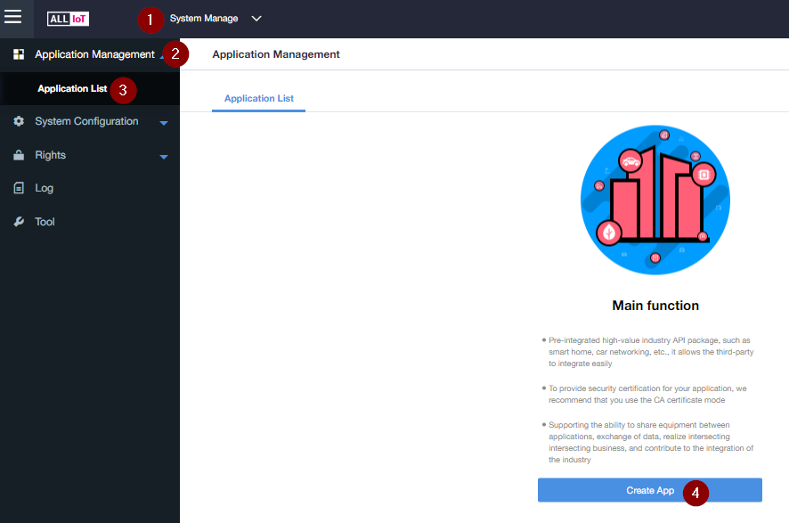
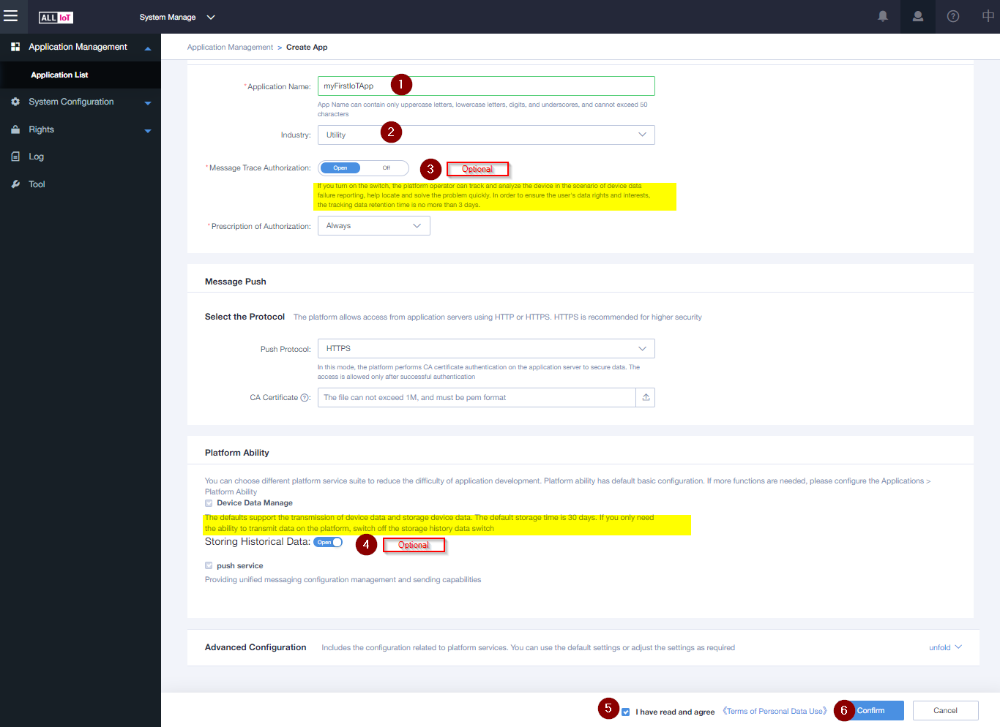
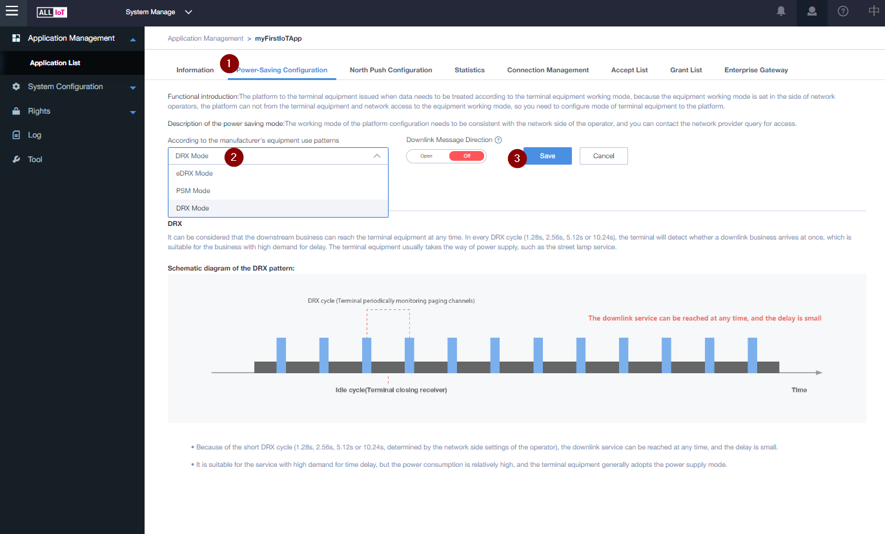

# Quickstart IoT-Gateway
- [Quickstart IoT-Gateway](#quickstart-iot-gateway)
  - [Login to IoT-Gateway](#login-to-iot-gateway)
- [Create your first Application](#create-your-first-application)
  - [App Detail](#app-detail)
  - [Next Step: Add your first device](#next-step-add-your-first-device)

## Login to IoT-Gateway
https://iotgateway.t-mobile.at/#/login 

# Create your first Application

1. Application Name
2. Select Enterprise [It is not mandatory, If you wish you can define and add       it from Right --> Organizations --> Create Root Organization]
3. Select if T-Mobile should be able to trace your Devices
4. Select Storage Mode
5. Select the Rule engine 
6. Agree to Terms
7. Confirm to create the App

1. Save Secret to Local  
   **You will need it later, to get access to your App via the API**
2. Go to App Detail

## App Detail

1. Choose the Power-Saving Configuration
2. Choose your Power saving Mode (use DRX for first App)
3. Click Save

## Next Step: [Add your first device](02&#32;Add&#32;first&#32;Device.md)

