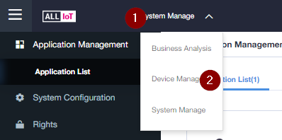
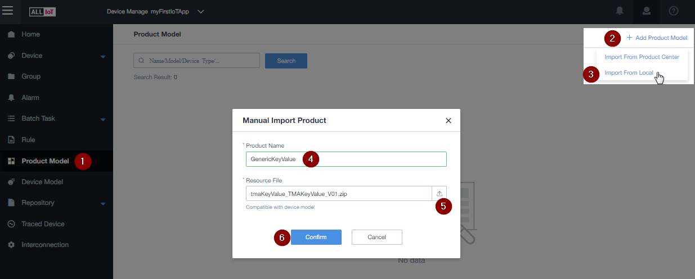
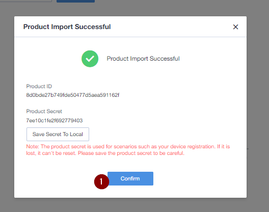
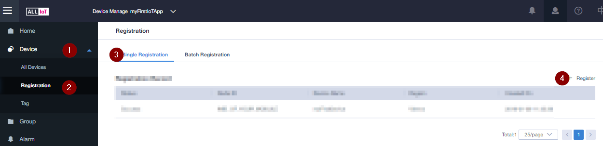
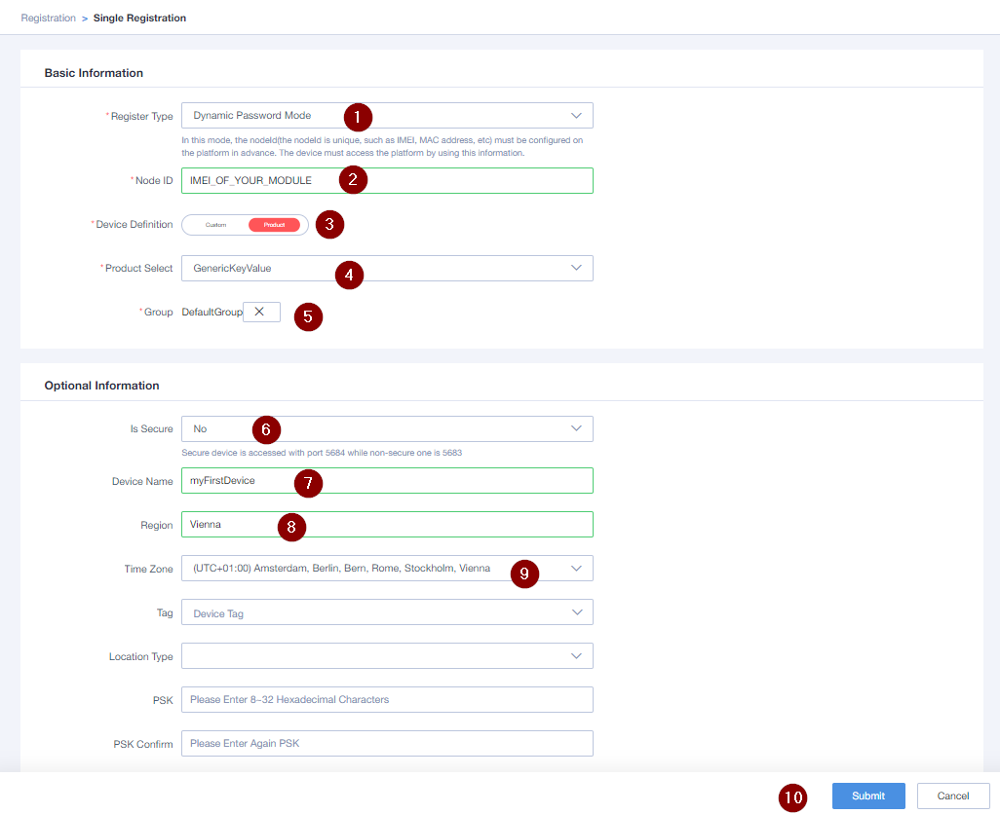
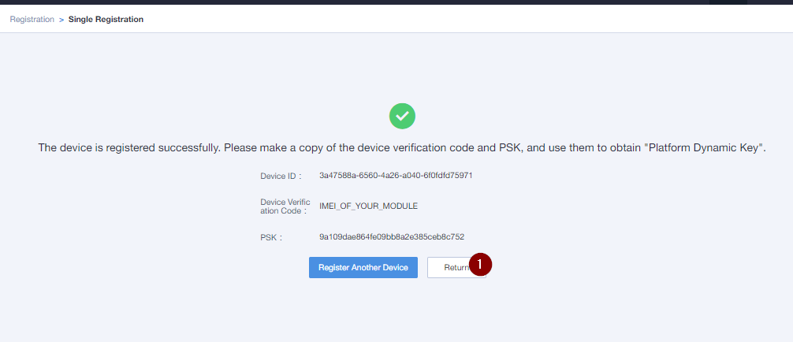

# Quickstart ALLIoT

# Add your first Device

# Import Product
1. Download Product from GitHub Page  
https://github.com/alliot-at/Quickstart/blob/master/Product%20Profiles/tmaKeyValue_TMAKeyValue_V01.zip

  

1. Choose Product Model
2. Add Product Model
3. Import from Local
4. Enter: "GenericKeyValue" as Product Name
5. Choose downloaded file
6. Press "Confirm" 

  
1. Press "Confirm"  
   You don't have to save the secret

# Register your first Device

  
1. Open "Device" Menu
2. Choose "Registration"
3. Select "Single Registration"
4. Press "+ Register"

  
1. Register Type: Dynamic Password Mode
2. Enter the IMEI of your module  
   The IMEI is printed on the module, or you can get it with the command:  `AT+CGSN=1` 
3. Choose Product
4. Select "GenericKeyValue"
5. Select "DefaultGroup"
6. Is Secure: No  **(only for testing)**  
   No - means that you can connect your module **with or without DTLS encryption**
7. Enter a Device Name
8. Region (e.g. Vienna)
9. Set the correct Time zone
10. Press "Submit" to finish registration

 
If you want to connect your device with DTLS encryption, save the PSK now!
1. Press "Submit" 

## Next Step: 

Connect your device:

* [Quectel BC68](Quectel&#32;BC68/03_Connect_device_to_ALLIoT.md)  
* [TODO Quectel BG96](Quectel#32;BG96)  
* [Ublox Sara N211/Sodaq](SARA#32,N211/03_Connect_device_to_ALLIoT.md)
* [TODO: Generic MQTT](jfkds)
* [TODO: Generic LWM2M](TODO)

