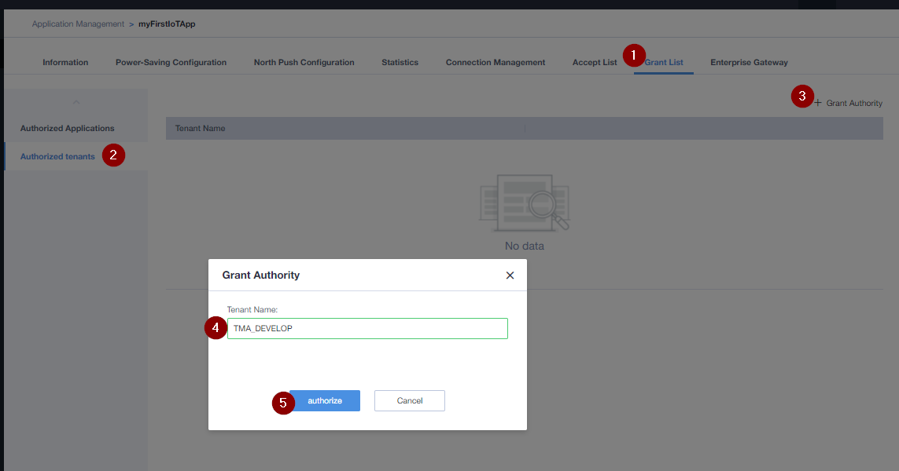
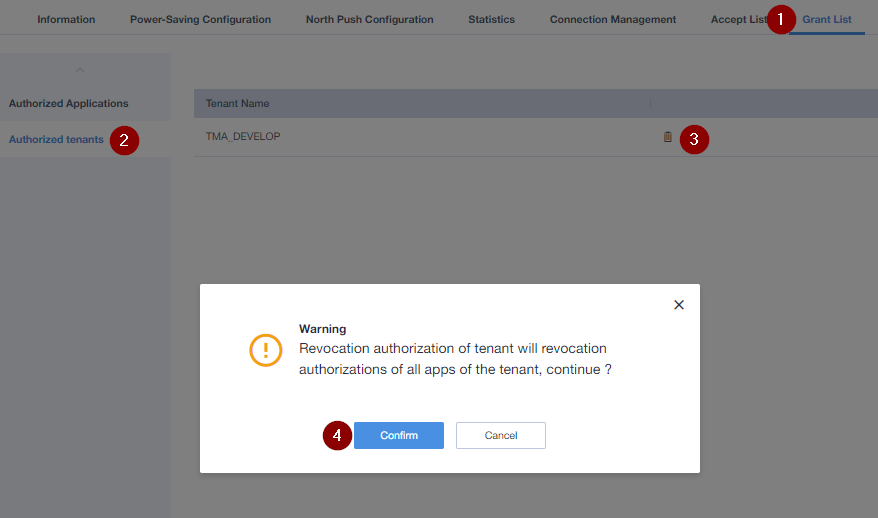

# Grant T-Mobile Access 
If you need support from us, we need access to your App.  

1. Click on System Management
2. Click on "Application List" and select your application
3. Choose Grant List
4. Authorized SP Users
5. Grant Authority
6. Enter: TMA_DEVELOP
7. Click: authorize

# Revoke Permission
