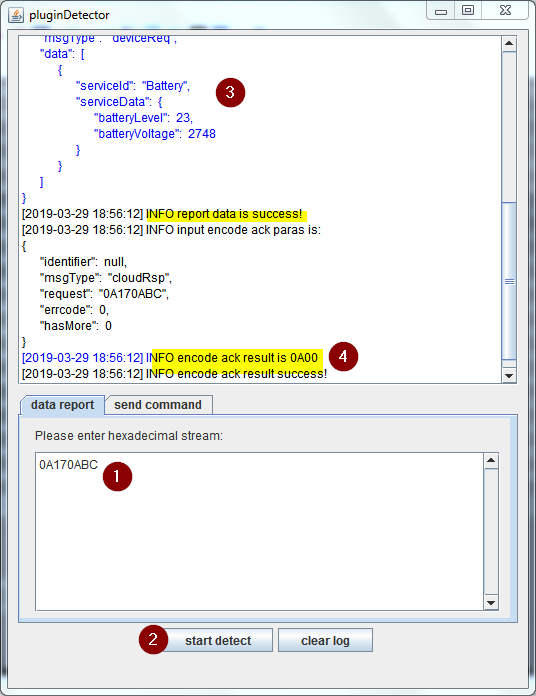

# CIG Plugin Development  (documentation not finished)
- [CIG Plugin Development (documentation not finished)](#cig-plugin-development-documentation-not-finished)
  - [Prepare Development Environment](#prepare-development-environment)
    - [Configure Maven Plugin:](#configure-maven-plugin)
  - [Import example CIG Plugin](#import-example-cig-plugin)
  - [Build CIG Plugin](#build-cig-plugin)
  - [Prepare CIG Testing Tool](#prepare-cig-testing-tool)
  - [Test the CIG Plugin offline](#test-the-cig-plugin-offline)
  - [Test the CIG Plugin online on IoT-Gateway](#test-the-cig-plugin-online-on-iot-gateway)
  - [Messages in the Demo Plugin](#messages-in-the-demo-plugin)
    - [BatteryMessage / MessageId: 0A](#batterymessage--messageid-0a)
    - [ConnectivityMessage / MessageId: 0B](#connectivitymessage--messageid-0b)
    - [ModemBatteryMessage / MessageId: 0C](#modembatterymessage--messageid-0c)
    - [LocationMessage / MessageId: 0D](#locationmessage--messageid-0d)
    - [ClockRequestMessage / MessageId: 0E](#clockrequestmessage--messageid-0e)
    - [BatteryAndSignalMessage / MessageId: 0F](#batteryandsignalmessage--messageid-0f)
    - [TemperatureMessage / MessageId: 01](#temperaturemessage--messageid-01)
    - [TemperatureArrayMessage / MessageId: 02](#temperaturearraymessage--messageid-02)
- [Build your own CIG - Plugin](#build-your-own-cig---plugin)
  - [Customize for your Product Model](#customize-for-your-product-model)


## Prepare Development Environment  
1. Download and extract Eclipse: https://www.eclipse.org/downloads/   
  [Installation Help ](https://wiki.eclipse.org/Eclipse/Installation)
2. Download an install Maven: http://maven.apache.org/download.cgi  (Binary zip archive)
### Configure Maven Plugin:  
1. Start Eclipse and choose Windows > Preferences. 
2. In the Preferences window, choose Maven > Installations. 
3. On the right pane, click Add.  
4. Select the directory, where you have unzipped maven - then click Finish.
5. Select the imported Maven plugin and click OK.

## Import example CIG Plugin
This CIG Plugin works with the Product Profile which is described here: 
[Device_Product_Profile_Development_Offline](Device_Product_Profile_Development_Offline.md)  
For Testing, you can compile and test it, without any modifications.  
How to prepare it for your Product Profile is described below.

1. Download the example CIG-Plugin and unzip it. [Download CIG-Plugin](..\Product&#32;Profiles\CIG_TestDevice_IoTCompany_NBIoTDevice\CIG_TestDevice_IoTCompany_NBIoTDevice.zip)
2. Open Eclipse and Import existing maven project
3. File > Import > Maven > Existing Maven Projects > Next
4. Choose the folder where you have unzipped the CIG-Plugin
5. Select pom.xml in the Projects-List.  
6. Click Finish. 

## Build CIG Plugin 

1. Open Command-Line and goto you Project Folder where the pom.xml is located.
2. Execute `mvn package`
3. If "BUILD SUCCESS" is displayed, the compiled package is located in the `target` folder.
4. The plugin is automatically zipped to `package.zip` - use this file to test the plugin.


## Prepare CIG Testing Tool

1. Download the [NB-IoT Encoding and Decoding Plugin Validation Tool](https://devcenter.huawei.com/ict/en/resource/tool)
2. Unzip the downloaded file
3. Copy your `devicetype-capability.json` from the Product Profile and the `package.zip` from the target Folder of your CIG Plugin into the same folder where `pluginDetector.jar` (from the downloaded zip) is located. 


## Test the CIG Plugin offline
Start `pluginDetector.jar`   
INFO: The testing tool does not send any Data to a Device or IoT-Gateway. It will only locally test the encoding and decoding of the CIG-Plugin.  
;
1. Enter your Data - this is the Data the Device would send to IoT Gateway
2. Click "start detect"
3. Check the decoding result, if it is successful
4. Check the encoding of the acknowledge message which is sent to the Device.

Explanation: 
As you see in the screenshot the Data is: 0A170ABC.
According to the CIG Plugin that means:
- 0x0A - is the MessageId - MessageId 10 is defined in the CIG-Plugin as BatterService Data
- 0x17 - is the BatteryLevel
- 0x0ABC - is the BatteryVoltage
- 0A00 is the Response for this MessageId, it is also defined in the CIG-Plugin.

## Test the CIG Plugin online on IoT-Gateway
The downloaded CIG-Plugin is already installed on the IoT-Gateway. 
So you can install the Product Model in your Application on the IoT-Gateway and register a new Device.   
[Download Product Model](../Product&#32;Profiles\TestDevice_IoTCompany_NBIoTDevice.zip)  
[How to Import Product Model.](../02&#32;Add&#32;first&#32;Device.md#import-product)

Now you can send Messages from your Device to the IoT-Gateway.

## Messages in the Demo Plugin

### BatteryMessage / MessageId: 0A

| Parameter      | Len[Byte] | Type   | Desc                 |
| -------------- | :-------: | ------ | -------------------- |
| msgId (0A)     |     1     | uint8  | Message Id = 0A      |
| BatteryLevel   |     1     | uint8  | BatteryLevel in %    |
| BatteryVoltage |     2     | uint16 | BatteryVoltage in mV |

Responses:   
Success: `0A00`  
Error: `0A01`  

Example:  
Data: `0A170ABC`  
Response: `0A00`

### ConnectivityMessage / MessageId: 0B

| Parameter      | Len[Byte] | Type  | Desc                  |
| -------------- | :-------: | ----- | --------------------- |
| msgId (0B)     |     1     | uint8 | Message Id = 0B       |
| signalStrength |     2     | int16 | signalStrength in dBm |


Responses:   
Success: `0B00`  
Error: `0B01`  

Example:  
Data: `0BFFAA`  -> -86 dBm  
Response: `0B00`

### ModemBatteryMessage / MessageId: 0C

| Parameter      | Len[Byte] | Type   | Desc                 |
| -------------- | :-------: | ------ | -------------------- |
| msgId (0C)     |     1     | uint8  | Message Id = 0C      |
| BatteryLevel   |     1     | uint8  | BatteryLevel in %    |
| BatteryVoltage |     2     | uint16 | BatteryVoltage in mV |

Responses:   
Success: `0C00`  
Error: `0C01`  

Example:  
Data: `0C170ABC`  
Response: `0C00`

### LocationMessage / MessageId: 0D

| Parameter  | Len[Byte] | Type  | Desc            |
| ---------- | :-------: | ----- | --------------- |
| msgId (0D) |     1     | uint8 | Message Id = 0D |
| latitude   |     4     | float | Latitude in °   |
| longitude  |     4     | float | Longitude in °  |

Responses:   
Success: `0D00`  
Error: `0D01`  

Example: 
Latitude=48.1872203 = 0x4240bfb7, Longitude=16.4025 = 0x41833852
Data: `0D4240bfb741833852`  
Response: `0D00`

Info: Float to hex: https://gregstoll.com/~gregstoll/floattohex/

### ClockRequestMessage / MessageId: 0E

| Parameter   | Len[Byte] | Type  | Desc             |
| ----------- | :-------: | ----- | ---------------- |
| msgId (0E)  |     1     | uint8 | Message Id = 0E  |
| timeRequest |     1     | uint8 | Time Request = 1 |

Responses:   
Success: `0EUNIX_TIMESTAMP_HEX`  
Error: `0E01`  

Example: 
Data: `0E01`  
Response: `0E5C9DDB77`

### BatteryAndSignalMessage / MessageId: 0F

| Parameter      | Len[Byte] | Type   | Desc                 |
| -------------- | :-------: | ------ | -------------------- |
| msgId (0F)     |     1     | uint8  | Message Id = 0F      |
| BatteryLevel   |     1     | uint8  | BatteryLevel in %    |
| BatteryVoltage |     2     | uint16 | BatteryVoltage in mV |
| signalStrength |     2     | int16 | signalStrength in dBm |

Responses:   
Success: `0F00`  
Error: `0F01`  

Example:  
Data: `0F170ABCFFAA`  
Response: `0F00`

### TemperatureMessage / MessageId: 01

| Parameter    | Len[Byte] | Type  | Desc                           |
| ------------ | :-------: | ----- | ------------------------------ |
| msgId (01)   |     1     | uint8 | Message Id = 01                |
| temperature  |     2     | int16 | Temperature * 10               |
| sendResponse |     1     | uint8 | optional, if set send response |

Responses (if sendResponse is set):   
Success: `0100`  
Error: `0101`  
	 
233 --> 23.3 °C  0x00E9
Example 1:
Data: `0100E9`  
No Response
	
Example 2:
Data: `0100E901`
Response: `0100

### TemperatureArrayMessage / MessageId: 02

| Parameter      | Len[Byte] | Type   | Desc                                |
| -------------- | :-------: | ------ | ----------------------------------- |
| msgId (02)     |     1     | uint8  | Message Id = 02                     |
| ts_start       |     4     | uint32 | Timestamp for 1. Temperature        |
| interval_mode  |     1     | uint8  | 1...sec, 2...min                    |
| interval       |     2     | uint16 | interval depending on interval_mode |
| 1. temperature |     2     | int16  | temperature                         |
| 2. temperature |     2     | int16  | temperature                         |
| .              |
| .              |
| n. temperature |     2     | int16  | temperature                         |

  
Responses:   
Success: `0200LEN`  
Error: `0201`  

Example: 
Data: `025C9DF06502000500E900F8`  
Response: `020002`

# Build your own CIG - Plugin
## Customize for your Product Model

1. Rename Project in Eclipse to `deviceType-manufacturerId-model` depending on your Product Profile. In our example it would be:  
deviceType: TestDevice  
manufacturerName: IoT_Company  
manufacturerId: IotCompany  
model: NBIoTDevice  
So the Project name is: `TestDevice-IoTCompany-NBIoTDevice`
2. Rename src/main/java Package Names to: `com.manufacturerName.model.deviceType`  
So the Package Name is: `com.IoT_Company.NBIoTDevice.TestDevice`   
**Enable Rename subpackages**
3. Rename src/test/java Package Names to: `com.manufacturerName.model.deviceType.Test`  
So the Package Name is: `com.IoT_Company.NBIoTDevice.TestDevice.Test`   
**Enable Rename subpackages**  
4. Update pom.xml  
Line 7: `<groupId>com.manufacturerName.model.deviceType</groupId>` (com.IoT_Company.NBIoTDevice.TestDevice)  
Line 9:  `<artifactId>deviceType-manufacturerId-model</artifactId>` (TestDevice-IoTCompany-NBIoTDevice)  
Line 85: `<Bundle-SymbolicName>deviceType-manufacturerId-model</Bundle-SymbolicName>` (TestDevice-IoTCompany-NBIoTDevice)
5. Update `/src/main/resources/OSGI-INF/CodecProvideHandler.xml`    
Update properties with ###
```xml
<?xml version="1.0" encoding="UTF-8"?>
<scr:component xmlns:scr="http://www.osgi.org/xmlns/scr/v1.1.0" immediate="true" name="###com.manufacturerName.model.deviceType###.ProtocolAdapterImpl">
    <implementation class="###com.manufacturerName.model.deviceType###.ProtocolAdapterImpl"/>
    <service>
        <provide interface="com.huawei.m2m.cig.tup.modules.protocol_adapter.IProtocolAdapter" />
    </service>
</scr:component>
```
Example:
```xml
<?xml version="1.0" encoding="UTF-8"?>
<scr:component xmlns:scr="http://www.osgi.org/xmlns/scr/v1.1.0" immediate="true" name="com.IoT_Company.NBIoTDevice.TestDevice.ProtocolAdapterImpl">
    <implementation class="com.IoT_Company.NBIoTDevice.TestDevice.ProtocolAdapterImpl"/>
    <service>
        <provide interface="com.huawei.m2m.cig.tup.modules.protocol_adapter.IProtocolAdapter" />
    </service>
</scr:component>
```
6. Update `/target/package/package-info.json`   
Update properties with ###
```json
{
    "specVersion":"1.0",
    "fileName":"###deviceType-manufacturerId-model###",
    "version":"1.0.0",
    "deviceType":"###deviceType###",
    "manufacturerName":"###manufacturerId###",
    "model":"###model###",
    "description":"codec",
    "platform":"linux",
    "packageType":"CIGPlugin",
    "date":"2019-03-06 12:16:59",
    "ignoreList":[],
    "bundles":[
    {
        "bundleName": "###deviceType-manufacturerId-model###",
        "bundleVersion": "1.0.0",
        "priority":5,
        "fileName": "###deviceType-manufacturerId-model###-1.0.0.jar",
        "bundleDesc":"",
        "versionDesc":""
    }]
}
```

Example:
```json
{
    "specVersion":"1.0",
    "fileName":"TestDevice-IoTCompany-NBIoTDevice",
    "version":"1.0.0",
    "deviceType":"TestDevice",
    "manufacturerName":"IoTCompany",
    "model":"NBIoTDevice",
    "description":"codec",
    "platform":"linux",
    "packageType":"CIGPlugin",
    "date":"2017-02-06 12:16:59",
    "ignoreList":[],
    "bundles":[
    {
        "bundleName": "TestDevice-IoTCompany-NBIoTDevice",
        "bundleVersion": "1.0.0",
        "priority":5,
        "fileName": "TestDevice-IoTCompany-NBIoTDevice-1.0.0.jar",
        "bundleDesc":"",
        "versionDesc":""
    }]
}
```
7. Now you should be able to build the CIG-Plugin (mvn package).
   


 