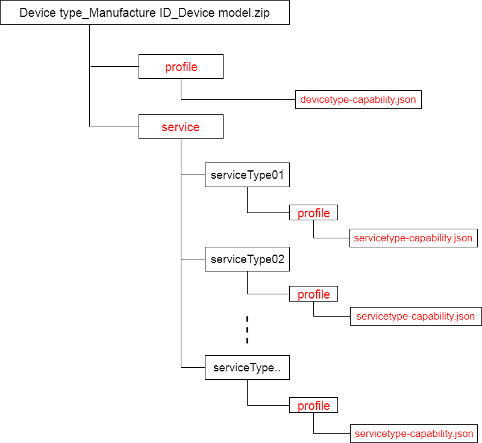
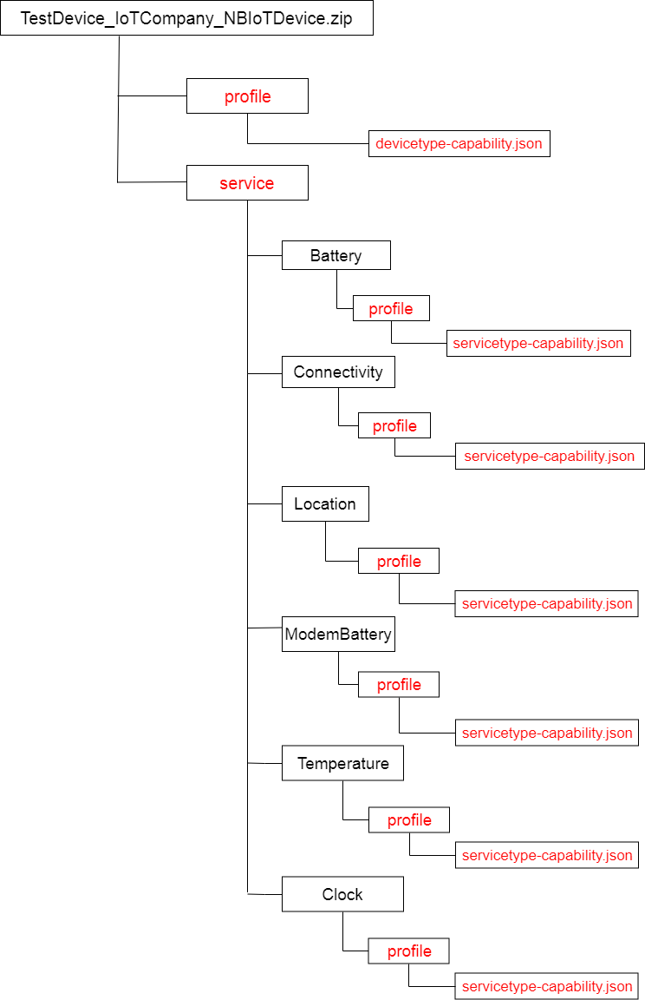

# **Device Capability Profile Development Guide** 

- [**Device Capability Profile Development Guide**](#device-capability-profile-development-guide)
- [Device profile naming rules](#device-profile-naming-rules)
- [Step 1 : Writing **"devicetype-capability.json"** file for General device](#step-1--writing-%22devicetype-capabilityjson%22-file-for-general-device)
- [Step 2 : Writing **"servicetype-capability.json"** file for General device](#step-2--writing-%22servicetype-capabilityjson%22-file-for-general-device)
- [Step 3 : Packing the profile for the IoT Gateway](#step-3--packing-the-profile-for-the-iot-gateway)

# Device profile naming rules
 - Device types, service types and serviceIDs must start with in **capital**.
 -  Attribute or service name, uncapitalise the first word and capitalise first letter of the second word.
 -  A device capability profile file name must be **"devicetype-capability.json"** 
 -  A service capability profile file name must be      **"servicetype-capability.json"**
 -  Static information (manufacture ID, manufacture name and device model) in device model must be unique.
 -  Universal service capabilities (Battery, Connectivity, DM, Location, Modem Battery) are already defined and should be same for every device model.

Detail described device model example shown below. This device model is for typical universal services. 


# Step 1 : Writing **"devicetype-capability.json"** file for General device

A devicetype-capability.json file include the static information about the device and the services along with om capabilities (FOTA, SOTA).

1) Create new folder named **"profile"**. (Name **must** be the same.)
2) Inside the **"profile"** folder, create the json file named **devicetype-capability.json** with using text editor. [If you using Notepad ++, File -> New]
3) Add this json code with mandatory field.
   ```
   {
      "devices": [
            {
                "manufacturerId": "ABC",
                "manufacturerName": "XYZ",
                "model": "NBIoTDevice",
                "protocolType": "LWM2M",
                "deviceType": "TestDevice",
                "omCapabilitiy": **....**   
                "serviceTypeCapabilities": **....**
            }
        ]
    }
   ``` 
4) Add this json **in the field** of omCapability.
 ```
    "omCapability":{
            "upgradeCapability" : {
                    "supportUpgrade":true,
                    "upgradeProtocolType":"PCP"
                        },
            "fwUpgradeCapability" : {
                    "supportUpgrade":true,
                    "upgradeProtocolType":"LWM2M"
                        }
                }
 ```
5) Add services **in the field** of serviceTypeCapabilities according to your device. ( In this test model we described with the universal services. )
```
"serviceTypeCapabilities": [
        {
          "serviceId": "Battery",
          "serviceType": "Battery",
          "option": ""
        },
        {
          "serviceId": "Connectivity",
          "serviceType": "Connectivity",
          "option": ""
        },
        {
          "serviceId": "ModemBattery",
          "serviceType": "ModemBattery",
          "option": ""
        },
        {
          "serviceId": "DM",
          "serviceType": "DM",
          "option": null
        },
        {
          "serviceId": "Location",
          "serviceType": "Location",
          "option": ""
        }
      ]
```
6) After adding the om capability and services, device-capability.json will look like 
```
{
  "devices": [
    {
      "manufacturerId": "ABC",
      "manufacturerName": "XYZ",
      "model": "NBIoTDevice",
      "protocolType": "LWM2M",
      "deviceType": "TestDevice",
      "omCapability":{
            "upgradeCapability" : {
                    "supportUpgrade":true,
                    "upgradeProtocolType":"PCP"
                        },
            "fwUpgradeCapability" : {
                    "supportUpgrade":true,
                    "upgradeProtocolType":"LWM2M"
                        }
                },
      "serviceTypeCapabilities": [
               {
                  "serviceId": "Battery",
                  "serviceType": "Battery",
                  "option": "Mandatory"
                },
                {
                  "serviceId": "Connectivity",
                  "serviceType": "Connectivity",
                  "option": "Mandatory"
                },
                {
                  "serviceId": "ModemBattery",
                  "serviceType": "ModemBattery",
                  "option": "Mandatory"
                },
                {
                  "serviceId": "DM",
                  "serviceType": "DM",
                  "option": null
                },
                {
                  "serviceId": "Location",
                  "serviceType": "Location",
                  "option": "Mandatory"
        }
      ]
    }
  ]
}
```
7) Save this file. Later we will need it for packing the profile.

# Step 2 : Writing **"servicetype-capability.json"** file for General device

1) Create the new folder named **"service"**. (Name **must** be the same.)
   
2) Inside the **"service"** folder, create folders according to your services. As we are creating device with the general services (Battery (01), Connectivity (02), ModemBattery (03), DM (04), Location (05)), **Create five new folder with the same name as your serviceType**.
   
3) Inside the **Battery** folder, create a new folder named **profile**. create **"servicetype-capability.json"** file inside the **profile** folder and add this json code.
```
{
  "services": [
        {
             "serviceType": "Battery",
             "description": "",
             "commands": [],
      "properties": [
             {
                 "propertyName": "batteryLevel",
                  "dataType": "int",
                "required": true,
                  "min": "0",
                  "max": "100",
                  "step": 1,
                  "maxLength": 0,
                  "method": "RWE",
                 "unit": null,
                  "enumList": null
              },
              {
                "propertyName": "batteryVoltage",
                  "dataType": "decimal",
                  "required": true,
                  "min": "0",
                 "max": "10",
                  "step": 0.1,
                  "maxLength": 0,
                  "method": "RWE",
                 "unit": "mV",
                  "enumList": null
             }
                 ],
        "events": []
         }
     ]
}
```
4) Inside the **Connectivity** folder, create a new folder named **profile**. create **"servicetype-capability.json"** file inside the **profile** folder and add this json code.

```
{
  "services": [
    {
      "serviceType": "Connectivity",
      "description": "",
      "commands": [],
      "properties": [
        {
          "propertyName": "signalStrength",
          "dataType": "int",
          "required": true,
          "min": "-150",
          "max": "150",
          "step": 1,
          "maxLength": 0,
          "method": "RWE",
          "unit": "dBm",
          "enumList": []
        }
      ],
      "events": []
    }
  ]
}
```

5)  Inside the **DM** folder, create a new folder named **profile**. create **"servicetype-capability.json"** file inside the **profile** folder and add this json code.
   
   
```
{
  "services": [
    {
      "serviceType": "DM",
      "description": null,
      "commands": [
        {
          "commandName": "PUSH_COMMAND",
          "paras": null,
          "responses": null
        },
        {
          "commandName": "UPDATE_CONFIGURATION",
          "paras": null,
          "responses": null
        },
        {
          "commandName": "COLLECT_LOG",
          "paras": null,
          "responses": null
        },
        {
          "commandName": "UPGRADE_BUNDLE",
          "paras": null,
          "responses": null
        },
        {
          "commandName": "INSTALL_BUNDLE",
          "paras": null,
          "responses": null
        },
        {
          "commandName": "START_BUNDLE",
          "paras": null,
          "responses": null
        },
        {
          "commandName": "STOP_BUNDLE",
          "paras": null,
          "responses": null
        },
        {
          "commandName": "UNINSTALL_BUNDLE",
          "paras": null,
          "responses": null
        },
        {
          "commandName": "BUNDLE_SYNCHRONIZATION",
          "paras": null,
          "responses": null
        },
        {
          "commandName": "UPGRADE_FIRMWARE",
          "paras": null,
          "responses": null
        },
        {
          "commandName": "UPGRADE_SOFTWARE",
          "paras": null,
          "responses": null
        },
        {
          "commandName": "GET",
          "paras": null,
          "responses": null
        },
        {
          "commandName": "REST",
          "paras": null,
          "responses": null
        },
        {
          "commandName": "REBOOT",
          "paras": null,
          "responses": null
        },
        {
          "commandName": "DOWNLOAD_SWPACKAGE",
          "paras": null,
          "responses": null
        },
        {
          "commandName": "SWUPDATE",
          "paras": null,
          "responses": null
        },
        {
          "commandName": "DOWNLOAD_FWPACKAGE",
          "paras": null,
          "responses": null
        },
        {
          "commandName": "FWUPDATE",
          "paras": null,
          "responses": null
        }
      ],
      "properties": [
        {
          "propertyName": "swVersion",
          "dataType": "string",
          "required": true,
          "min": "1",
          "max": "2147483646",
          "step": 0,
          "maxLength": 256,
          "method": "R",
          "unit": null,
          "enumList": null
        },
        {
          "propertyName": "fwVersion",
          "dataType": "string",
          "required": true,
          "min": "1",
          "max": "2147483646",
          "step": 0,
          "maxLength": 256,
          "method": "R",
          "unit": null,
          "enumList": null
        }
      ],
      "events": null
    }
  ]
}
```
6) Inside the **Location** folder, create a new folder named **profile**. create **"servicetype-capability.json"** file inside the **profile** folder and add this json code.
```
{
  "services": [
    {
      "serviceType": "Location",
      "description": "",
      "commands": [],
      "properties": [
        {
          "propertyName": "longitude",
          "dataType": "decimal",
          "required": true,
          "min": "-180",
          "max": "180",
          "step": 0.1,
          "maxLength": 0,
          "method": "RWE",
          "unit": "°",
          "enumList": []
        },
        {
          "propertyName": "latitude",
          "dataType": "decimal",
          "required": true,
          "min": "-90",
          "max": "90",
          "step": 0.1,
          "maxLength": 0,
          "method": "RWE",
          "unit": "°",
          "enumList": null
        }
      ],
      "events": []
    }
  ]
}
```
7) Inside the **ModemBattery** folder, create a new folder named **profile**. create **"servicetype-capability.json"** file inside the **profile** folder and add this json code.

```
{
  "services": [
    {
      "serviceType": "ModemBattery",
      "description": "",
      "commands": [],
      "properties": [
        {
          "propertyName": "batteryLevel",
          "dataType": "int",
          "required": true,
          "min": "0",
          "max": "100",
          "step": 1,
          "maxLength": 0,
          "method": "RWE",
          "unit": "",
          "enumList": null
        },
        {
          "propertyName": "batteryVoltage",
          "dataType": "decimal",
          "required": true,
          "min": "0",
          "max": "100",
          "step": 0.1,
          "maxLength": 0,
          "method": "RWE",
          "unit": "mV",
          "enumList": []
        }
      ],
      "events": []
    }
  ]
}
```

# Step 3 : Packing the profile for the IoT Gateway
   - ## General hierarchy of device profile
  The general file folder hierarchy should be look like this. **Names which are written in red fonts are case sensitive and your profile should have same name.**

  1) Compressed the **profile** folder and **service** folder in .zip format.
  2) Our Device is ready for IoT Gateway.
  3) Device model what we developed, should be look like this after the .zip compression.

  

   - ## Example hierarchy of the developed General profile
  