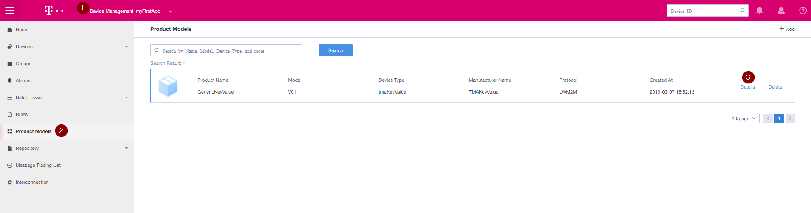
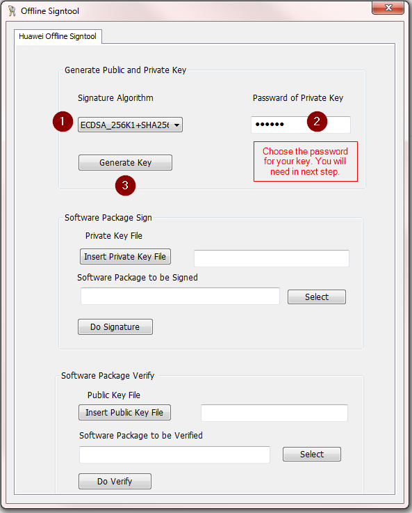
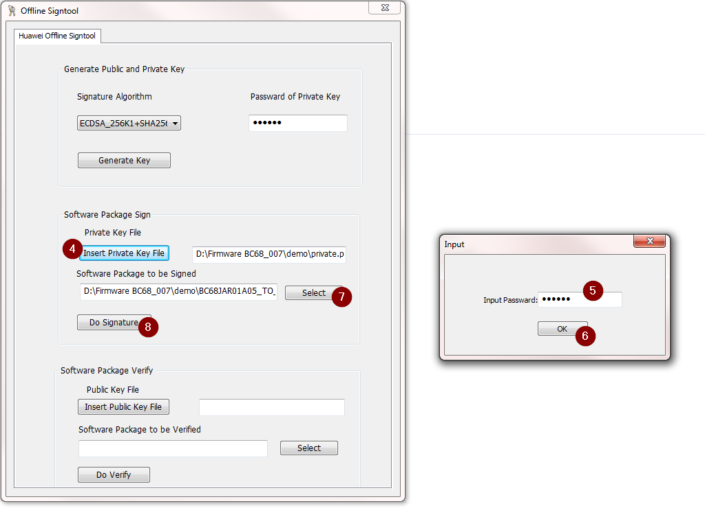
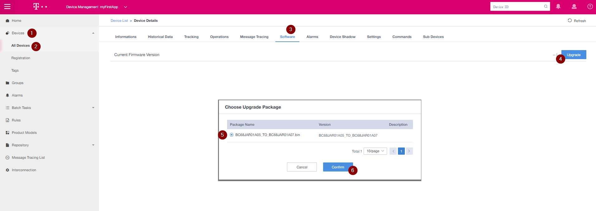
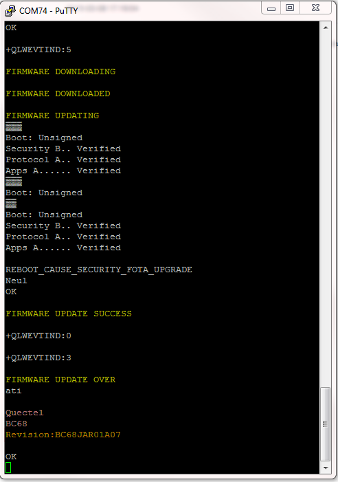

# **FOTA (Firmware Over The Air) using IoT-Gateway** 

- [**FOTA (Firmware Over The Air) using IoT-Gateway**](#fota-firmware-over-the-air-using-iot-gateway)
- [Introduction FOTA (Firmware Over The Air) using IoT-Gateway](#introduction-fota-firmware-over-the-air-using-iot-gateway)
- [Configure the maintenance capabilities of the product](#configure-the-maintenance-capabilities-of-the-product)
- [Download the Signature tool from IoT Gateway](#download-the-signature-tool-from-iot-gateway)
- [Signature the Firmware](#signature-the-firmware)
  - [Step : 1 Generate the Private and Public Keys](#step--1-generate-the-private-and-public-keys)
  - [Step : 2 Sign the Firmware package](#step--2-sign-the-firmware-package)
  - [Step : 3 Verify the Firmware package](#step--3-verify-the-firmware-package)
- [Upload the Key and firmware](#upload-the-key-and-firmware)
  - [Step : 1 Upload Public Key](#step--1-upload-public-key)
  - [Step : 2 Upload signed Firmware version](#step--2-upload-signed-firmware-version)
- [Submit the task for Firmware Update](#submit-the-task-for-firmware-update)
- [During the FOTA Update](#during-the-fota-update)

# Introduction FOTA (Firmware Over The Air) using IoT-Gateway

Firmware is a software which is embedded in the NB-IoT radio module. The main common reason for the firmware update is to bring new features and to fix the issues in the previous version of the firmware. First and foremost, download the updated firmware version accordingly to your the device.

For Quectel BC68 module, you can download the firmware version from GitHub Folder

# Configure the maintenance capabilities of the product

1. Choose the device Application
2. Click on "Product Models"
3. Click on "Details"
4. Click on "Maintenance Capability Configuration"
5. Enable the Firmware Upgrade by clicking Supported.
6. Choose the Firmware Upgrade Protocol as "LWM2M"
7. Press "Confirm"

# Download the Signature tool from IoT Gateway

1. Go to System Management
2. Click on "Tools"
3. Download the "offline plugin tool"

# Signature the Firmware

## Step : 1 Generate the Private and Public Keys

1. Choose the Signature Algorithm (You can choose any, does not matter.)
2. Select the Password of Private key. (Remember it, you will need it in [Step 2](#Step2))
3. Click on "Generate Key" (Small window popup will ask for the location, Save in preferable location)

## Step : 2 Sign the Firmware package 

4. Insert the Private Key file
5. Input the Password (Same as you used in [Step 1](#Step1) )
6. Click on "OK"
7. Select the Firmware zip file
8. Click on "Do Signature" 

## Step : 3 Verify the Firmware package 

9. Insert the Public Key (Which you received after finishing [Step 1](#Step1) )
10. Select the signed zip folder (Typically named as "Firmware_signed.zip" as shown in snapshot.)
11. Click on "Do verify"
    
# Upload the Key and firmware

## Step : 1 Upload Public Key

1. Select your APP and Click on "Device Management" 
2. Click on "Repository"
3. Click on "Public Keys"
4. click on "Upload"
5. Upload the Public Key
6. Select the "Manufacture Name" (If you don't remember, you can check in the Device profile)
7. Click on "Save"

## Step : 2 Upload signed Firmware version
Same as [Step 1](#Step1), Go to "Repository" and follow given steps.

1. Click on "Firmware"
2. Click on "Upload"
3. Upload the Firmware version signed zip
4. Write version name same as signed firmware file version
5. Write your Device Type
6. Write Manufacture Name of your product model
7. Select the Model of your product model
8. Write protocol name as "LWM2M"
9. Click on "Save"

# Submit the task for Firmware Update

1. Click on "Devices"
2. Click on "All Device" and choose your device for the Firmware Update
3. Click on "Software"
4. Click on "Upgrade"
5. Choose the package name
6-7. Click on "Confirm"

# During the FOTA Update

Device Firmware updated successfully.