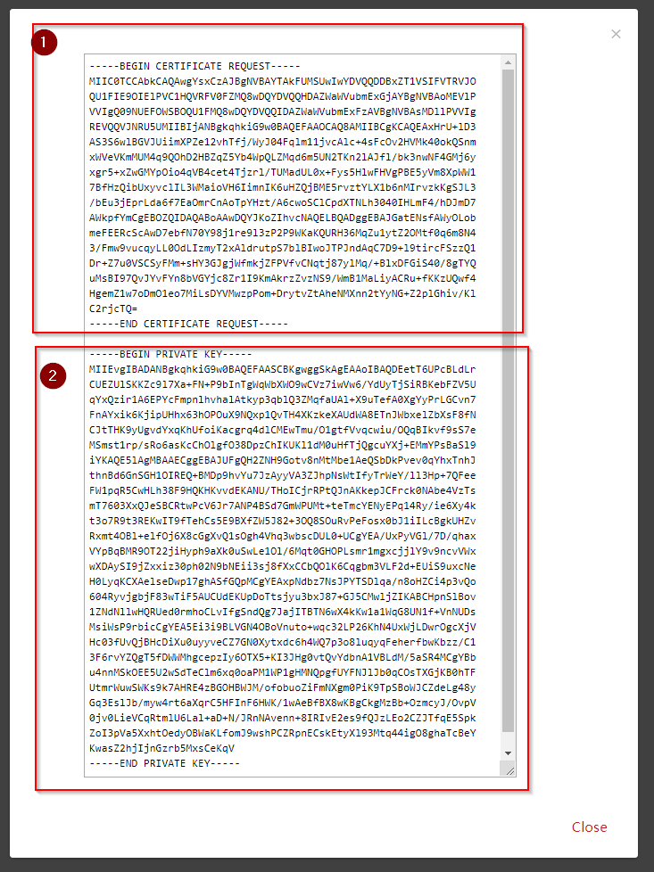

# How to get your certificates (coming soon)

- [How to get your certificates (coming soon)](#how-to-get-your-certificates-coming-soon)
- [Create your Certificate Signing Request](#create-your-certificate-signing-request)
  - [Create CSR Online (Option 1)](#create-csr-online-option-1)
  - [Create CSR Offline (Option 2)](#create-csr-offline-option-2)
- [Request your Certificate from T-Mobile](#request-your-certificate-from-t-mobile)

While this tutorial you were using Demo Certificates to connect to the REST API. But in production, you have to use your own Client Certificates.

Therefore you have to create a CSR (Certificate Signing Request).

You can create the CSR online or offline on your PC.
# Create your Certificate Signing Request

## Create CSR Online (Option 1)
Before you create the CSR Online, please check the security considerations. https://csrgenerator.com/security

* Goto https://csrgenerator.com/
* Enter your data into the form

1. Enter your Country Code (e.g. AT, DE)
2. Enter your State (eg. Vienna, Burgenland)
3. Enter your Locality (eg. Linz, Innsbruck)
4. Enter your Organisation Name
5. Enter your Department (eg. IT, Security, IoT)
6. Enter your Username on IoT-Gateway
7. Choose Key Size: 2048
8. Click Generate CSR

* Save your CSR and Private Key to a File on your PC



1. Copy/paste the CSR to a file on PC (*.csr)  
2. Copy/paste the Private Key to a file on your PC (*.key)

Next Step: [Request your Certificate from T-Mobile](#request-your-certificate-from-t-mobile)

## Create CSR Offline (Option 2)

* Install OpenSSL for Windows or Linux  

Execute this command:  
`openssl req -nodes -new -newkey rsa:2048 -keyout IoTGatewayTMA.key -sha256 -out IoTGatewayTMA.csr`

This command generates this output: 
```
Generating a RSA private key
......................+++++
.......+++++
writing new private key to 'IoTGatewayTMA.key'
-----
You are about to be asked to enter information that will be incorporated
into your certificate request.
What you are about to enter is what is called a Distinguished Name or a DN.
There are quite a few fields but you can leave some blank
For some fields there will be a default value,
If you enter '.', the field will be left blank.
-----
```

Then enter the following data:
1. Enter your Country Code (e.g. AT, DE)  
`Country Name (2 letter code) [AU]: AT`  
2. Enter your State (eg. Vienna, Burgenland)  
`State or Province Name (full name) [Some-State]:Vienna  `  
3. Enter your Locality (eg. Linz, Innsbruck)  
`Locality Name (eg, city) []:Vienna  `  
4. Enter your Organisation Name  
`Organization Name (eg, company) [Internet Widgits Pty Ltd]:ACME  `  
5. Enter your Department (eg. IT, Security, IoT)  
`Organizational Unit Name (eg, section) []:IoT  ` 
6. Enter your Username on IoT-Gateway   
`Common Name (e.g. server FQDN or YOUR name) []:YOUR USERNAME  `  
7. Enter your E-Mail Address  
`Email Address []:office@acme.com  `  
8. Optional attributes  
`Please enter the following 'extra' attributes  `    
`to be sent with your certificate request  `  
9. Optional: do net enter a password  
`A challenge password []:  `  
10. Optional: do not enter a optional comapny name  
`An optional company name []:`  

Now you have created your CSR-File (`IoTGatewayTMA.csr`) and your KEY-File (`IoTGatewayTMA.key`).

Next Step: [Request your Certificate from T-Mobile](#request-your-certificate-from-t-mobile)

# Request your Certificate from T-Mobile

1. Send the *.csr File to "TODO"@t-mobile.at to get your certificate.  
Within seven days you will receive your Certificate.
2. When you have received your Certificate, you can use it with your Key-File in your application, or with Postman instead of the Demo Certificates.

---
__Save your Key-File, you need it later to use your   Certificate.__  
__DO NOT SEND YOUR Key-File to T-Mobile.__  
__KEEP YOUR Key-File SECURE__

---  


 

 
