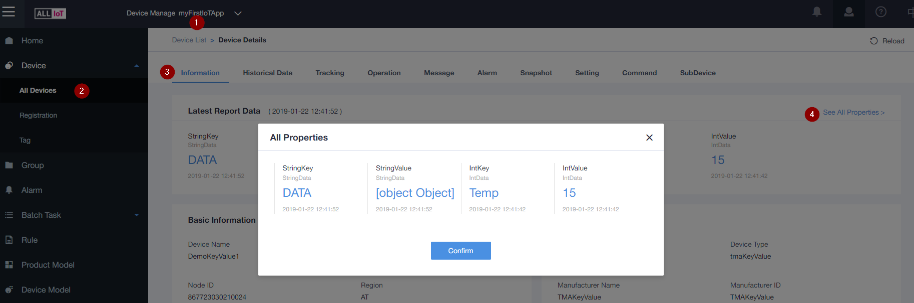
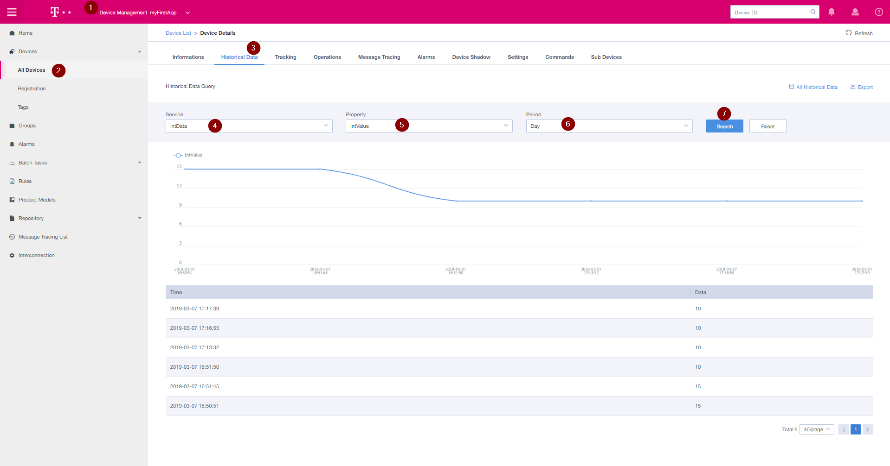
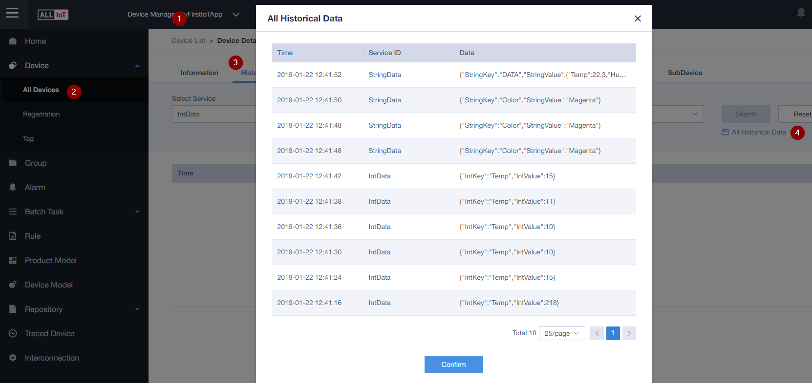

# Send data from Device to IoT-Gateway
- [Send data from Device to IoT-Gateway](#send-data-from-device-to-iot-gateway)
  - [Prerequisites:](#prerequisites)
  - [Send Integer Data](#send-integer-data)
  - [Send String Data](#send-string-data)
- [Watch data on IoT-Gateway](#watch-data-on-iot-gateway)
  - [Last Data](#last-data)
  - [Historical Data](#historical-data)
  - [ALL Historical Data](#all-historical-data)
  - [Next Step:](#next-step)

## Prerequisites:  
* [Create your first Application](../01&#32;Create&#32;first&#32;Application.md)
* [Add your first device](../02&#32;Add&#32;first&#32;Device.md)
* [Connect device to IoT-Gateway](03_Connect_device_to_IoT-Gateway.md)
* Open Putty and connect to your device

[Detailed Information about Upload Protocol](GenericKeyValue_LWM2M.md)

In this tutorial we are using the GenericKeyValue Product Model, here we always have to upload a Key and a Value (e.g Key="Temp", Value=23).

In Production you will have a specific Product Model for your Device, then you only will upload the Value. 

FYI: ASCII to Hex Converter: https://www.binaryhexconverter.com/ascii-text-to-hex-converter
 

## Send Integer Data

Command Syntax:
```
AT+QLWULDATAEX = 8        ,06    04           54656d70       000F       , 0x0100 ,1  
AT+QLWULDATAEX = len(dec) ,MsgId key_len(hex) key(ascii_hex) value(hex) , flags  , seq_num
```
Info:  
MsgId 06 => IntData with no Response from IoT-Gateway  
MsgId 01 => Int Data with Response from IoT-Gateway / Response = (AA01)

"Temp" in ASCII (Hex) = 54656d70  (54 65 6d 70 => T e m p)    

1. Check if device registration is complete (Response after connect to network):  
     +QLWEVTIND=0  
     +QLWEVTIND=3  
2. Send Data **without** confirmation  
    `AT+QLWULDATAEX=8,060454656d70000F,0x0000`     // Data: Temp=15
3. Send Data **with** confirmation  
    `AT+QLWULDATAEX=8,060454656d70000A,0x0100,1`   //Data Temp=10  
    Response:  
    `+QLWULDATASTATUS:4,1`  //Response on Protocol Layer  
    4 ... means success  
    1 ... is the seq_num (Sequence Number) from the send command (last Parameter)

4. Send Data with Early Release Flag active **without** confirmation  
   Early Release means that the Device immediately switches after sending data into Idle Mode, without Early Release it waits 20 seconds. 
   So this feature can be used to save power, if the Device normally receives no data after sending.

   `AT+QLWULDATAEX=8,060454656d70000A,0x0001`      //Data: Temp=10  
    
   Responses if AT+CSCON=1
   ```
   +CSCON:1  //Connected Mode
   +CSCON:0  // Idle Mode
   ```

5. Send Data with Early Release Flag active **with** confirmation  
   Here the UE waits for the confirmation on protocol Layer, then it
   switches immediately into Idle Mode. 
   `AT+QLWULDATAEX=8,060454656d70000B,0x0101`
    
   Responses if AT+CSCON=1
   ```
   +CSCON:1             //Connected Mode

   +QLWULDATASTATUS:4   //Response on Protocol Layer
   
   +CSCON:0             // Idle Mode
   ``` 

FYI: If you need a response from IoT-Gateway - just use MsgId 01 instead of 06

## Send String Data

Command Syntax:
```
AT+QLWULDATAEX = 15       ,00    05           436f6c6f72     07             4d6167656e7461   , 0x0100 , 1
AT+QLWULDATAEX = len(dec) ,MsgId key_len(hex) key(ascii_hex) value_len(hex) value(ascii_hex) , flags  , seq_num
```
Info:  
MsgId 07 => String Data with no Response from IoT-Gateway  
MsgId 00 => String Data with Response from IoT-Gateway / Response = (AA00)

1. Send String Data with Response from IoT-Gateway  
   In this Example we will send Key=Color / Value=Magenta     
   Color in ASCII Hex = 436f6c6f72  / Len=5  
   Magenta in ASCII Hex = 4d6167656e7461 / Len=7  
   
   `AT+QLWULDATAEX=15,0005436f6c6f72074d6167656e7461,0x0000,1`  
   Response:
   ```
   +NNMI:2,AA00 
   ```


2. Send JSON Data with Response from IoT-Gateway  
   Key = "DATA",  => 44415441 / len: 4  
   Value = {"Temp":22.3,"Hum":20,"Weight":23,"Color":"Magenta"} =>  
   7b2254656d70223a32322e332c2248756d223a32302c22576569676874223a32332c22436f6c6f72223a224d6167656e7461227d  / len: 52 = 0x34

   `AT+QLWULDATAEX=59,000444415441347b2254656d70223a32322e332c2248756d223a32302c22576569676874223a32332c22436f6c6f72223a224d6167656e7461227d,0x0000,1`  

    Response:  
   ```
   +NNMI:2,AA00 
   ```

FYI: If you don't need a response from IoT-Gateway to save traffic and power - just use MsgId 07 instead of 00

# Watch data on IoT-Gateway

## Last Data

1. Choose Application
2. Select your Device
3. Select Information Tab
4. Click "See All Properties"

## Historical Data

1. Choose Application
2. Select your Device
3. Select Historical Data Tab
4. Select the Service 
5. Select the property
6. Select the period (Hour,Day,Week,Year)
7. Click on "Search"

## ALL Historical Data

1. Choose Application
2. Select your Device
3. Select Historical Data Tab
4. Click on "All Historical Data"

## Next Step:
[Start to get your data out of IoT-Gateway](../Application&#32;Enablement/05_Install_and_setup_Postman.md)

