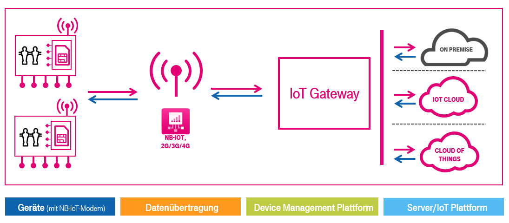

# IoT-Gateway Architecture 

# Quickstart Guides

* [Step 1 - Create your first Application](01&#32;Create&#32;first&#32;Application.md)
* [Step 2 - Add your first device](02&#32;Add&#32;first&#32;Device.md)

## Connect devices

### Quectel BC68
* [Step 3 - Connect to IoT-Gateway](Quectel&#32;BC68/03_Connect_device_to_IoT-Gateway.md) 
* [Step 4 - Send Data](Quectel&#32;BC68/04_Send_Data_BC68.md)

### Ublox N211 / Sodaq
* [Step 3 - Connect to IoT-Gateway](SARA&#32;N211/03_Connect_device_to_IoT-Gateway.md)
* [Step 4 - Send Data](SARA&#32;N211/04_Send_Data_N211.md)

## Application Enablement
* [Step 5 - Install and setup Postman](Application&#32;Enablement/05_Install_and_setup_Postman.md)
* [Step 6 - Connect to REST API](Application&#32;Enablement/06_Connect_to_REST_API.md)
* [Step 7 - Get your data out of IoT-Gateway](Application&#32;Enablement/07_Get_your_data_out_from_IoT-Gateway.md)

# Advanced Topics
* [Firmware update over the air (FOTA) via the IoT-Gateway](Advanced_Topics/FOTA_using_IoT-Gateway.md)
* Request your own Client Certificate for REST API
* Product Development (*coming soon*)
* CIG Plugin Development (*coming soon*)
