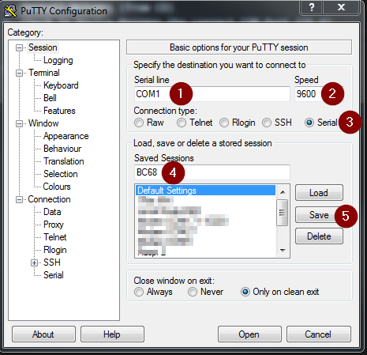
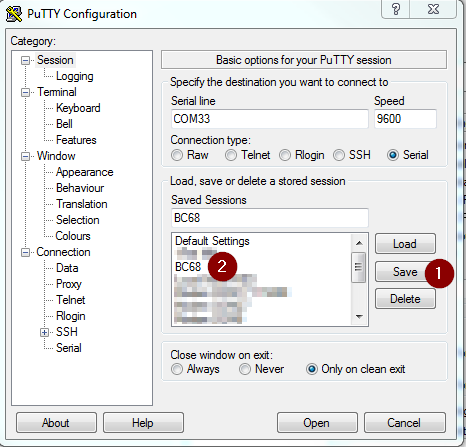

# Connect u-blox SARA N211 / SODAQ SARA AFF N211 to IoT-Gateway

## Prerequisites:  
* [Create your first Application](../01&#32;Create&#32;first&#32;Application.md)
* [Add your first device](../02&#32;Add&#32;first&#32;Device.md)
* Install Putty   
  https://www.chiark.greenend.org.uk/~sgtatham/putty/latest.html  
* If you are using SODAQ SARA AFF N211 follow this instructions:  
  https://support.sodaq.com/sodaq-one/sara/  
  to load the Passthrough-Sketch (nbIOT_serial_passthrough) on your Arduino then  
  close ArduinoIDE

## Configure Device
1. Insert SIM Card
2. Mount antenna
4. Connect it with USB to your PC
5. Check in Device Manager the correct COM-Port (Arduino Zero)  
6. Open Putty
7. Configure Putty  (instead of BC68 use N211)
---
     
   1. Enter correct COM-Port
   2. Set Baud rate (Speed) to 9600
   3. Connection Type: Serial
   4. Enter "N211" as name
   5. Press save
---
     
   1. Select "Terminal"
   2. Local echo: Force On
   3. Local line editing: Force On
   4. Select "Session"
---
     
   1. Press Save
   2. Double-Click to "N211" to connect Putty to your BC68 Module  
---

9. Check Connection  
   Enter `ATI` to check module
   Response:
   `SARA-N211-02X`

10. Prepare N211  (do it only once)
    ```
    AT+NCONFIG="CR_0354_0338_SCRAMBLING","TRUE"
    AT+NCONFIG="CR_0859_SI_AVOID","FALSE
    AT+NCONFIG="AUTOCONNECT","FALSE"     # Disable Auto connect
    AT+NRB                               # Reboot - wait until finished (10sec)
    AT+NCDP="10.112.28.10",5683            # Set IP-Address of IoT-Gateway
    AT+NRB                               # Reboot - wait until finished (10sec)
    AT+CFUN=1                            # Enable Radio Module
    AT+CGDCONT=0,"IP","alliot.nbiot.at"  # Set APN
    AT+CPSMS=0                           # Disable Power Saving Mode
    AT+NRB                               # Reboot - wait until finished (10sec)
    ```
11. Connect to NB-IoT Network and IoT-Gateway (do it after each reboot) 
     ```
    //Enable Module Output
    
    AT+NRB                  # Reboot 
    AT+CEREG=1              # Enable network registration unsolicited result code: “+CEREG:<stat>”
    AT+CSCON=1              # Enable Signalling Connection Status
    AT+CFUN=1               # Enable Radio Module
    AT+CGDCONT=0,"IP","alliot.nbiot.at"  # Set APN
    AT+CPSMS=0              # Disable Power Saving Mode
    AT+NPSMR=1              # Enable Power Saving Mode Status Report
    AT+NNMI=1               # Enable New Message Indications
    AT+COPS=1,2,"23203"     # Forces an attempt to select and register with the network operator (23203 is T-Mobile AT) wait for 30sec – 300sec 
    ```
    ### Responses from Module
    ```

    +CEREG:2      # Search for Network  

    +CSCON:1      # Connected Mode

    +CEREG:5      # Attached to Network

    ...

    +CSCON:0      # Idle Mode

    ...

    +NPSMR:1      # Power Saving Mode active

    ```  

    

12. Send data from your Device to IoT-Gateway  / Link: [Send DATA](04_Send_Data_N211.md)

# Troubleshooting


## Check Signal
```
AT+NUESTATS         # Query UE Statistics

        Response:
        Signal power:-815   # Signal Power in centibels (RSRP..Reference signal received quality)
        Total power:-707    # Total power in centibels  (RSSI..Received signal strength indicator)
        TX power:120        # current Tx power level in centibels
        TX time:1263        # total Tx time since last reboot in millisecond
        RX time:1914285     # total Rx time since last reboot in millisecond
        Cell ID:7164511     # last cell ID
        ECL:1               # last CoverageExtension Level [0,1,2]
        SNR:10              # last Signal to noise ratio value
        EARFCN:3547         # last Absolute radio-frequency channel number 
        PCI:186             # last Physical ID of the cell 
        RSRQ:-139           # Reference signal received quality in centibels
      

AT+NUESTATS=CELL    # Get neighbour cells

        Response:
        #           EARFCN,PCI,A,RSRP,RSRQ,RSSI,SNR    A...1 indicates the current serving cell
        NUESTATS:CELL,3547,186,1,-813,-134,-715,10

        NUESTATS:CELL,3547,235,0,-868,-108,-1354,200

        NUESTATS:CELL,3547,244,0,-847,-108,-1354,200

        NUESTATS:CELL,3547,338,0,-874,-108,-1354,200

        NUESTATS:CELL,3547,464,0,-880,-108,-1354,200
    
```  

In case that you need support, please attach the output of `AT+NUESTATS=ALL` to your support request.

## Check IP Address
``` 
AT+CGPADDR
        Response:
        +CGPADDR:0,10.X.Y.Z


AT+NPING="10.112.28.10"   # IP of IoT-Gateway, you are not able to ping any other IP address

        Response OK:
        +NPING:10.112.28.10,61,909

        Response ERROR:
        +NPINGERR:1
```

## Check IoT-Gateway  
* [Add your first device](../02&#32;Add&#32;first&#32;Device.md)
* Check if your IMEI is correct.


