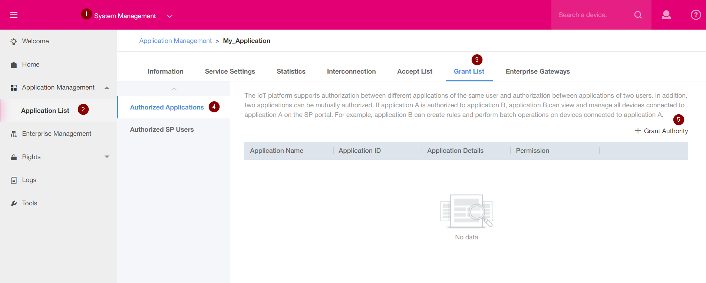
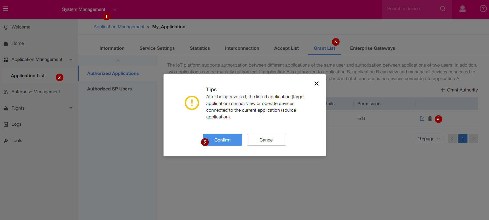

# Grant Magenta Telekom Access 

If you need support from us, we need access to your App.  

1. Click on System Management
2. Click on "Application List" and select your application
3. Choose Grant List
4. Authorized Applications
5. Grant Authority
6. Target Application : Application of another SP user
7. Application ID : WGEivX54MFr4F1KvPQ8AePG9BIQa  (This is the typical App ID used by us for support, by using this ID you can grant support to us)
8. Permission : edit
9. Click on Grant

## Revoke the application Permission

