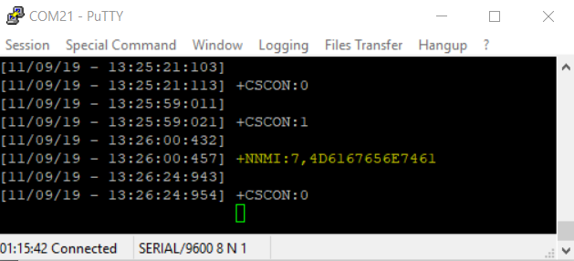

# Send a Raw Data and Command to the IoT-Gateway
Before following this document, make sure you have registered your device with product model called `"Raw_Data"` in IoT-Gateway. 

The product model `"Raw_Data"`  can be found in [Product Profile Section](https://github.com/magentabusiness/IoT-Quickstart/raw/master/docs/Product%20Profiles/RawData_MagentaIoT_RawDataModel.zip).

## Step:1 Register device successfully with Demo product model (Raw_Data_with_Command)

## Step:2 Open putty and send data 

1. We will send the data in format of string.
   
2. Convert the String to HEX format.

3. Send the data from the Putty to IoT-Gateway.

4. Data will be received by the IoT-Gateway in base-64 format.

## Example for sending the data.

- Assume that we want to send the data "Magenta"
- String (Magenta) -----> HEX is "4d6167656e7461"
- Putty terminal should be response with confirmation.
  
       
       AT+QLWULDATA=7,4d6167656e7461
       OK
       
-  Check the Device in the IoT-Gateway, it should receive data in base 64 format like below. Go to device History data.
   
   

- Received data should be look like ``"TWFnZW50YQ=="``.

- Decode the received data via Base-64 to String converter.  
  ``Base-64 (TWFnZW50YQ==) --> String (Magenta)``

## Example for sending command 

- Assume that we want to send the command "Magenta" string to the device.
- String (Magenta) ----->  Base 64 is "TWFnZW50YQ=="
- Either you can send via IoT-Gateway as described [here](../Application_Enablement/09_Send_Command_to_the_Device_via_IoT-Gateway.md) or via Postman as explained [here](../Application_Enablement/08_Send_Command_to_the_Device_via_Postman.md).
- Here, example showed via IoT-Gateway.

1. Selct Command: ``RawData:CMD``   
   rawData: ``TWFnZW50YQ==``

2. Command recevied at Putty 
    
    
  
3. Decode the received command via HEX to String converter.
   ``HEX (4D6167656E7461) --> String (Magenta)``

