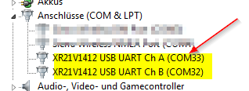
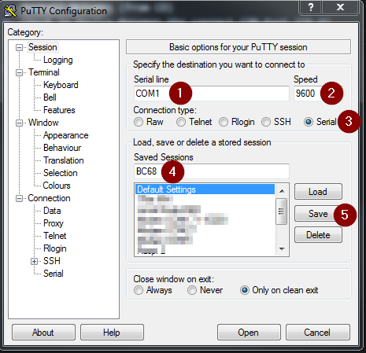
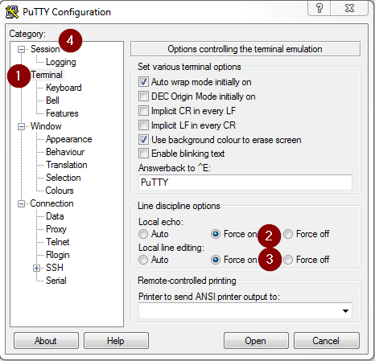
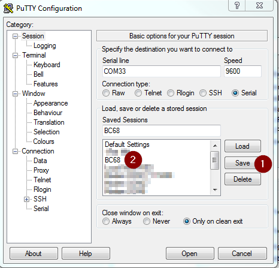
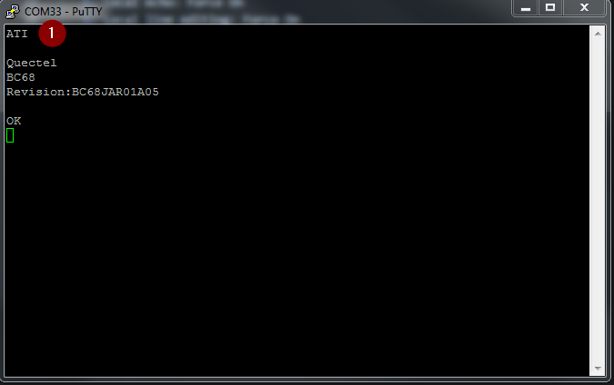

# Connect to the Network with Public APN and Send UDP data

# Connect Quectel BC68 to the Network with Public APN

!> **Prerequisites**
 > * [Install Putty](https://www.chiark.greenend.org.uk/~sgtatham/putty/latest.html)  
 > * [Download latest Drivers](https://www.exar.com/product/interface/uarts/usb-uarts/xr21v1412)   

# Configure Device
1. Insert SIM Card
2. Mount antenna
3. Check if DIP-Switch (J302) is in position: MAIN UART TO USB
4. Connect it with USB to your PC
5. Install Drivers
6. Check in Device Manager the correct COM-Port (Ch A)  
   
7. Open Putty  


# Configure Putty     

       
   1. Enter correct COM-Port
   2. Set Baud rate (Speed) to 9600
   3. Connection Type: Serial
   4. Enter "BC68" as name  
   5. Press save

       
   1. Select "Terminal"
   2. Local echo: Force On
   3. Local line editing: Force On
   4. Select "Session"  

       
   1. Press Save
   2. Double-Click to "BC68" to connect Putty to your BC68 Module  


# Check Connection  
     
  Enter `ATI` to check module.

# Prepare BC68 (Do it Only once)
```
AT+NCONFIG=AUTOCONNECT,FALSE               # Disable Auto connect
AT+NRB                                     # Reboot - wait until finished (10sec)
AT+NBAND=8                                 # Set Band 8 for Magenta Telekom - speeds up time to connect
AT+NRB                                     # Reboot - wait until finished (10sec)
AT+CFUN=1                                  # Enable Radio Module
AT+CGDCONT=0,"IP","m2m.nbiot.t-mobile.at"  # Set APN
AT+CPSMS=0                                 # Disable Power Saving Mode
AT+QREGSWT=2                               # Only needed, If you ever used the same module before with IoT-Gateway
AT+NCONFIG=AUTOCONNECT,TRUE                # Enable Auto connect
AT+NRB                                     # Reboot - wait until finished (10sec)
```

# Connection with Network
```
AT+NPSMR=1                           # Enable Power Saving Mode Status Report
AT+CEREG=1                           # Enable network registration unsolicited 
result code: “+CEREG:<stat>”
AT+NNMI=1                            # Enable New Message Indications
AT+CSCON=1                           # Enable Signalling Connection Status
```
**Responses from Module**
```

 +CEREG:2      # Search for Network  

 +CSCON:1      # Connected Mode

 +CEREG:5      # Attached to Network

 ...
 +CSCON:0      # Idle Mode

 ...

 +NPSMR:1      # Power Saving Mode active
```

# Connect Manually (Troubleshooting)
   ```
    AT+NCONFIG=AUTOCONNECT,FALSE
    AT+NRB                                     # Reboot - wait until finished (10sec)
    AT+NBAND=8                                 # Set Band 8 for Magenta Telekom - speeds up time to connect
    AT+CFUN=1                                  # Enable Radio Module
    AT+CGDCONT=0,"IP","m2m.nbiot.t-mobile.at"  # Set APN
    AT+CPSMS=0                                 # Disable Power Saving Mode
    AT+QREGSWT=2                               # Only needed, If you ever used the same module before with IoT-Gateway
    AT+NRB                                     # Reboot - wait until finished (10sec)
    AT+CFUN=1                                  # Enable Radio Module
    AT+NPSMR=1                                 # Enable Power Saving Mode Status Report
    AT+CEREG=1                                 # Enable network registration unsolicited 
    result code: “+CEREG:<stat>”
    AT+NNMI=1                                  # Enable New Message Indications
    AT+CSCON=1                                 # Enable Signalling Connection Status
    AT+COPS=1,2,"23203"                        # Forces an attempt to select and register with the
                                               # network operator (23203 is Magenta Telekom AT) wait for 30sec – 300sec 
   ```


## Check Signal
```
AT+NUESTATS         # Query UE Statistics

        Response:
        Signal power:-758   # Signal Power in centibels (RSRP..Reference signal received quality)
        Total power:-719    # Total power in centibels  (RSSI..Received signal strength indicator)
        TX power:40         # current Tx power level in centibels
        TX time:2330        # total Tx time since last reboot in millisecond
        RX time:73205       # total Rx time since last reboot in millisecond
        Cell ID:6160743     # last cell ID
        ECL:1               # last CoverageExtension Level [0,1,2]
        SNR:134             # last Signal to noise ratio value
        EARFCN:3547         # last Absolute radio-frequency channel number 
        PCI:254             # last Physical ID of the cell 
        RSRQ:-109           # Reference signal received quality in centibels
        OPERATOR MODE:4     # operator mode
        CURRENT BAND :8     # NBIoT deployment band 

AT+NUESTATS=CELL    # Get neighbour cells

        Response:
        #           EARFCN,PCI,A,RSRP,RSRQ,RSSI,SNR    A...1 indicates the current serving cell
        NUESTATS:CELL,3547,254,1,-757,-108,-716,136
    
```  

In case that you need support, please attach the output of `AT+NUESTATS=ALL` to your support request.

## Check IP Address
``` 
AT+CGPADDR
        Response:
        +CGPADDR:0,A.X.Y.Z


AT+NPING=8.8.8.8  # IP of google, you are not able to ping IoT Platform IP with Public APN

 Response OK
 +NPING:8.8.8.8,52,2867

 Response ERROR:
 +NPINGERR:1
```

# Send the UDP Data to the private server.

```
AT+NSOCR=DGRAM,17,0,1                     # Create a socket for UDP
Response : 1
           OK


AT+NSOST=1,IP,PORT,5,1234567890,100       # Send a message
Response : 1,5
           OK
           +NSOSTR:1,100,1

If you receive a command, to read the command (+NSONMI:1,5)
AT+NSORF=1,5
Response : 1,IP,PORT,5,Command,0            # 1 : Socket
                                            # IP : Sender IP
                                            # PORT : Port
                                            # 5 : Length of the command
                                            # "MSG" : Command
```

# Note
```
For an every device establishing connection through public APN, all incoming and outgoing traffic must pass through a router (Typically a NAT device, which used to solve address depletion and routing scalability problem). 

When performing NAT on UDP, it has some issues due to:
1. UDP has no connection establishment and clearing procedures as in TCP.

2. An association may not be completely clear: UDP is connectionless; it can rely on only the two endpoint address/port number combinations.

Due to the NAT device and routing, your device will re-establish network connection every 30 minutes and so on.

```