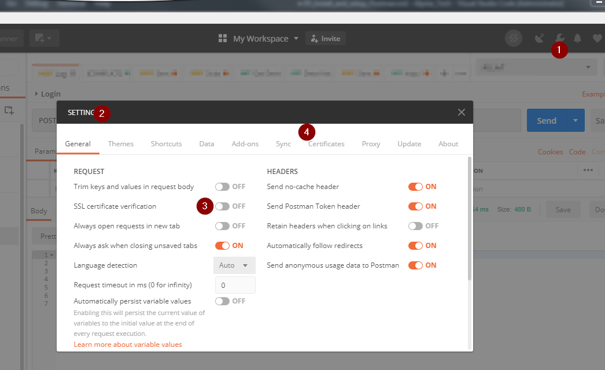
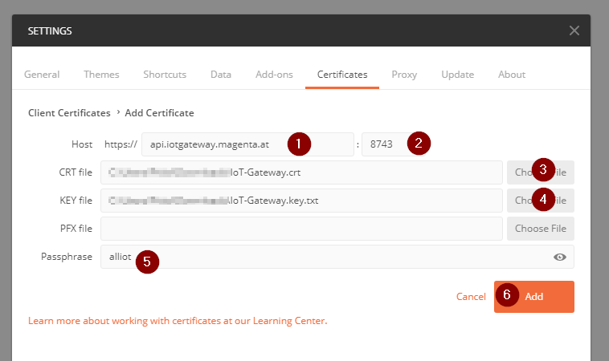
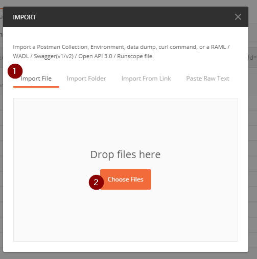
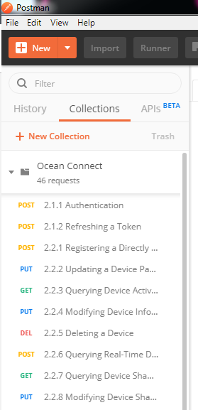
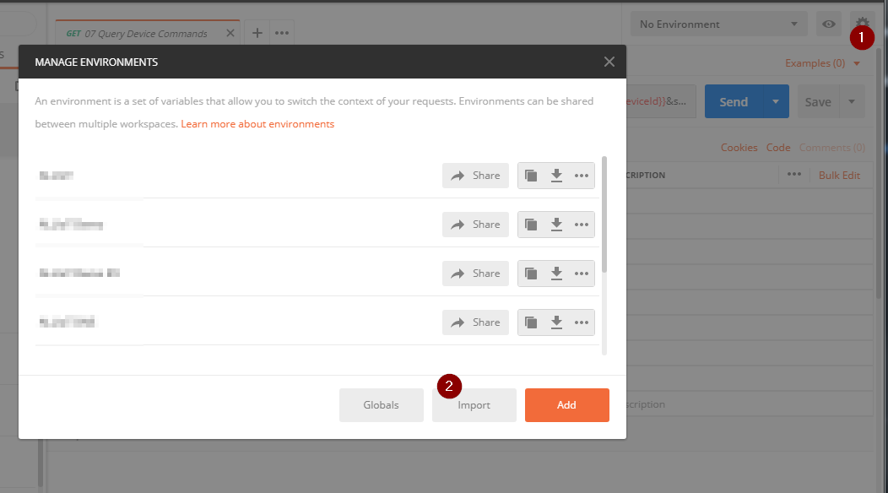
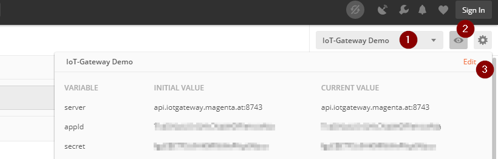
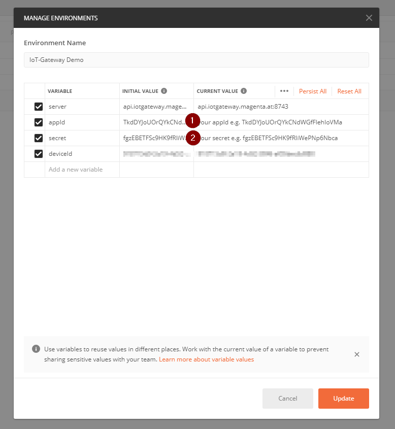

## Install Postman

Download and install Postman on your PC   
https://www.getpostman.com/

## Configure Postman

Open Settings  
1. Click Settings Icon
2. Select Settings
3. SSL Verification off 
4. Choose Certificates for the next step
   

## Import Demo Certificate
 
**IMPORTANT: You may only use this client Certificate only for testing.**  
**For production use, you have to request your own client certificate from Magenta Telekom.**

* Download (Save Link to PC): [Demo Certificate](https://github.com/magentabusiness/IoT-Quickstart/raw/master/docs/Application_Enablement/Demo_Client_Certificates/IoT-Gateway.crt)
* Download (Save Link to PC): [Demo Certificate Key](https://github.com/magentabusiness/IoT-Quickstart/raw/master/docs/Application_Enablement/Demo_Client_Certificates/IoT-Gateway.key)

1. Host: api.iotgateway.magenta.at
2. Port: 8743
3. CRT File --> choose "IoT-Gateway.crt" 
4. Key File --> choose "IoT-Gateway.key" 
5. Password: alliot
6. Click Add

## Import Examples

* Download Examples (Save Link to PC): 
  [IoT-Gateway Examples](https://github.com/magentabusiness/IoT-Quickstart/raw/master/docs/Application_Enablement/IoT-Gateway_Demos.postman_collection.json)  
Import in Postman
1. File -> Import  
2. Import File  
  
Choose File IoT-Gateway_Demos.postman_collection.json
3. After import   
   

## Import and Configure Postman Environment

Environments

An environment is a set of key-value pairs. The key represents the name of the variable. You can use a data editor to modify an environment.

While working with APIs, you often need different setups for your local machine, the development server, or the production API. Environments let you customize requests using variables so you can easily switch between different setups without changing your requests.

You won’t have to remember all those values once they are in Postman. You can download environments, save them as JSON files, and upload them later.

You can create, share, duplicate, export, and delete an environment. You can also import an environment as a single JSON file. 

Further informations: [Here](https://learning.getpostman.com/docs/postman/environments_and_globals/manage_environments/)

### Import IoT-Gateway Environment

* Download Examples (Save Link to PC):
  [IoT-Gateway Environment](https://github.com/magentabusiness/IoT-Quickstart/raw/master/docs/Application_Enablement/IoT-Gateway_Demo.postman_environment.json)  

1. Click "Manage Environments"
2. Click "Import"
3. Choose "IoT-Gateway_Demo.postman_environment.json"

### Configure IoT-Gateway Environment

Open Environment    

1. Choose "IoT-Gateway Demo" 
2. Click "Environment quick look"
3. Click "Edit"

Configure the Environment for your Application and Device    
Now you need your Application Credentials, which you have downloaded in the first Part of the Tutorial ( [Create your first Application](../01&#32;Create&#32;first&#32;Application.md) )  (Step: Save Secert to Local)  
So open the File and get your AppID and AppSecret

1. Enter your AppId
2. Enter your App Secret

## Next Step: [Connect to the Rest API](./Application_Enablement/06_Connect_to_REST_API.md) {docsify-ignore}

## Troubleshooting

If you have lost your AppSecret you can reset it, to get a new one. 
But then the old secret will not work anymore.
1. Open IoT-Gateway
2. Got to "System Manage" and choose your App
Click Reset to get a new AppSecret.

 
  
