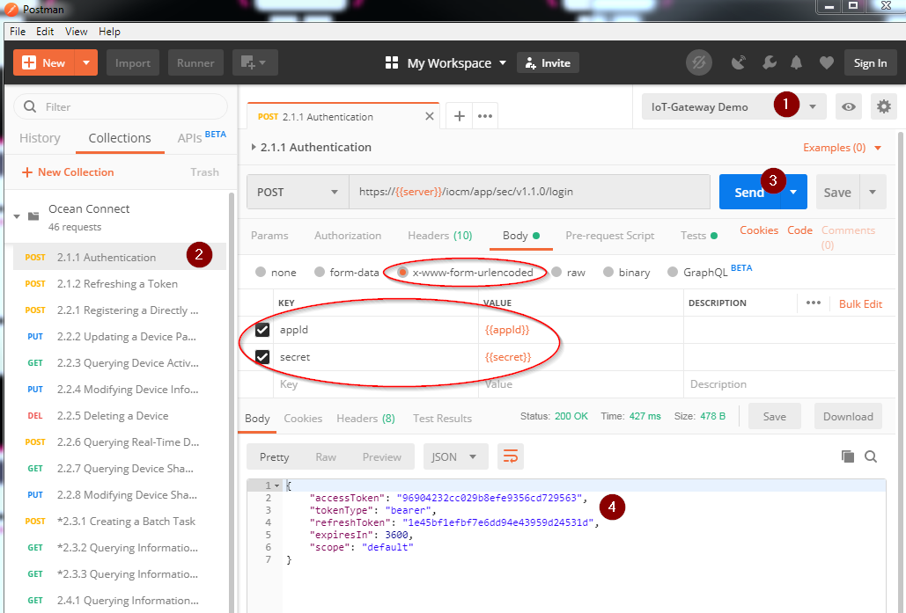
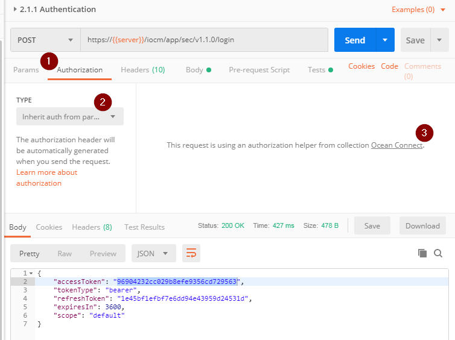
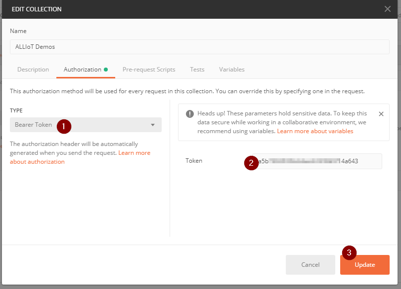

# Connect to REST API (Application Enablement)

After you have installed and configured Postman, you are ready to connect to the API and get your data out of IoT-Gateway.

# Login


1. Check you have selected the IoT-Gateway Demo Environment
2. Open the `2.1.1 Authentication Request`
3. Press "Send"
4. Check the Response

How does it work:  
For Login you have to send a POST Request to this URL:  
  
```
https://{{server}}/iocm/app/sec/v1.1.0/login
Content-Type:application/x-www-form-urlencoded
Body: 
{ 
    appId=******&secret=****** 
}
```
Postman will replace **{{server}}** with the "server" variable from the Environment.

The response contains the `accessToken`. This token is used for Authentication in the following requests. 
The accessToken is valid for 60 minutes, after this time the token gets invalid. 


# How to use accessToken for the next requests

Postman can save the accessToken to use it automatically for the next requests.

Copy the accessToken Value from the response in your clipboard. 




1. Select Authorization
2. Select "Inherit auth from parent"
3. Click on IoT-Gateway Demos


1. Select "Bearer Token"
2. Enter your accessToken 
3. Press Update

Now Postman will automatically add the accessToken to the Request Header for all Requests in the "IoT-Gateway Demos" collection.

If you got a new accessToken you have to repeat this step. 

## Next step: [Get your data out of IoT-Gateway](./Application_Enablement/07_Get_your_data_out_from_IoT-Gateway.md) {docsify-ignore}
