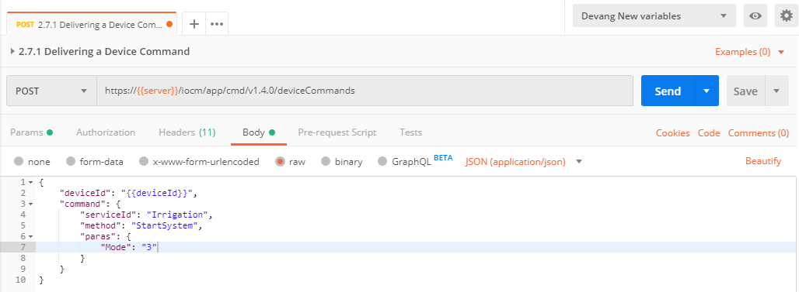
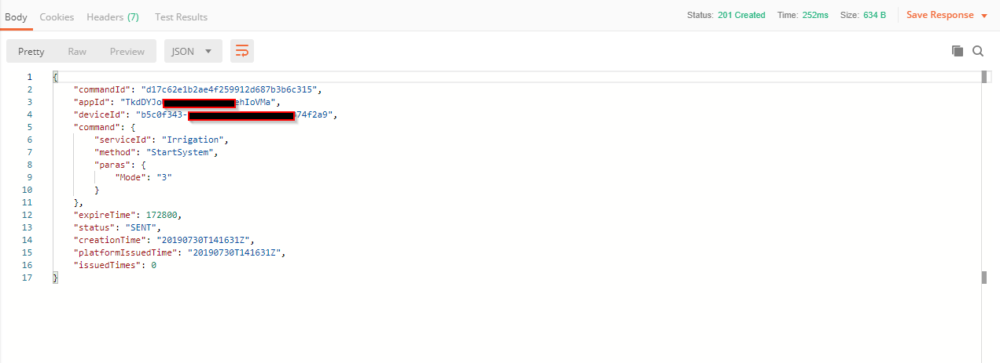
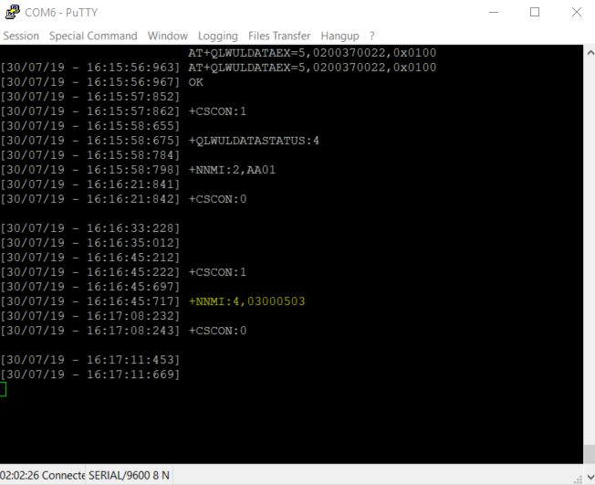
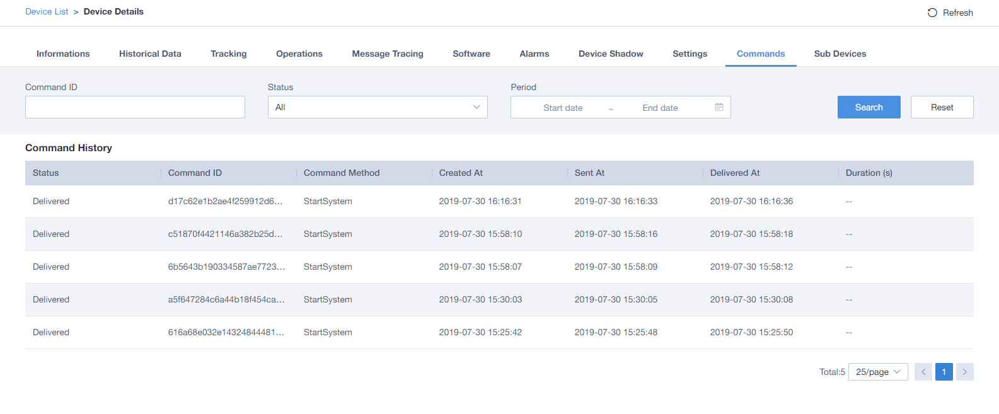
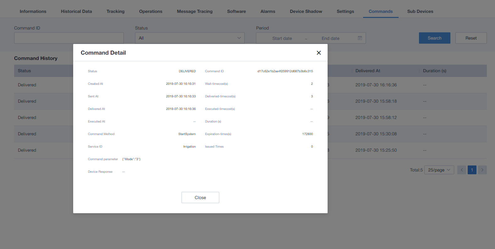

# How to send command to the Device.

## Make sure following things checked before proceed further.
1. Check that you have a valid accessToken, Otherwise Login again and get the accessToken. [You can follow `Application Enablement --> Connect to the Rest API` for the accessToken.]
   
2. Check your respective device model or Product profile, whether it contains any commands or not. For this document we have used  `"Irrigation"` product profile. [You can find Irrigation product profile in `Product Profiles --> Irrigation_TMAIoT_DemoDevice` ]

## Send Command to the device 

1. Select `2.7.1 Delivering a Device Command` from the IoT-Gateway Demo Connection.
   
2.  Detail Description.
    
    ````
    REQUEST : POST
    URL     : https://{{server}}/iocm/app/cmd/v1.4.0/deviceCommands?{{appId}}
    ````
    Header : 
    ````
    "app_key: <<appId>
    "Authorization:Bearer <<accessToken>> 
    "Content-Type:application/json;
    ````
    Body : 
    
    Type : raw and JSON (application/json). 

    Below in the raw, insert json according to your Device profile [ serviceID,method,parameters ]. Here example is with Ittigation Device profile which contains serviceID = "Irrigation", method = "StartSystem" and parameters = "Mode" (which is typically 0-100).

    ````
    {
    "deviceId": "{{deviceId}}",
    "command": {
        "serviceId": "Irrigation",
        "method": "StartSystem",
        "paras": {
            "Mode": "3"
                 }
              }
    }
    ````

    It should look like snapshot below.

    


3. Click on send button.

4. Response should look like :
  
  ```` 
  {
    "commandId": "c51870f4421146a382b25d476bc2e7d1",
    "appId": "TkdDY****************FlehIoVMa",
    "deviceId": "b5c0f*************ed5be374f2a9",
    "command": {
        "serviceId": "Irrigation",
        "method": "StartSystem",
        "paras": {
            "Mode": "3"
        }
    },
    "expireTime": 172800,
    "status": "SENT",
    "creationTime": "20190730T135810Z",
    "platformIssuedTime": "20190730T135810Z",
    "issuedTimes": 0
}
  ````

  It should look like snapshot below.

  Note : The status of the command which is "DELIVERED" in the snapshot can be PENDING. Which is according to your power saving feature setting for the application like PSM, DRX, or eDRX.

   

5. Check in Putty. Putty will receive command like this :

   

6. Command can be seen in the platform like snapshot below.
  
  

7. For the more detailes of the sent command, just click on any command detail window will be pop up like shown below. 

  