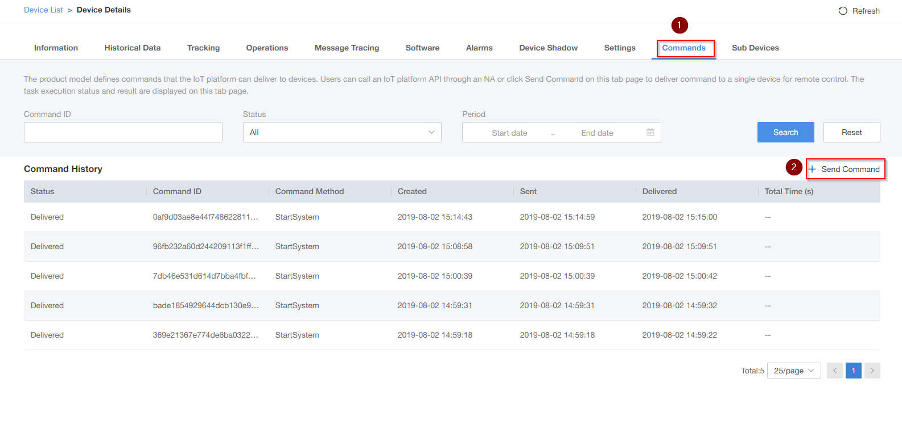
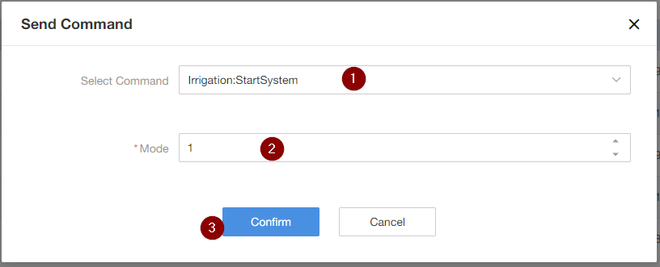
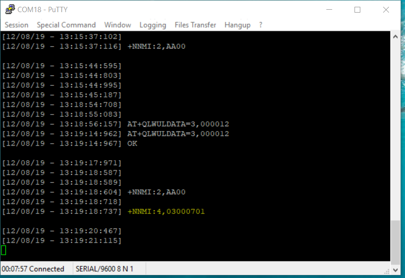
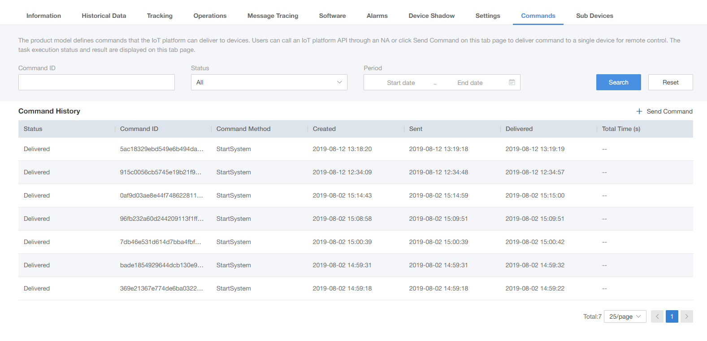
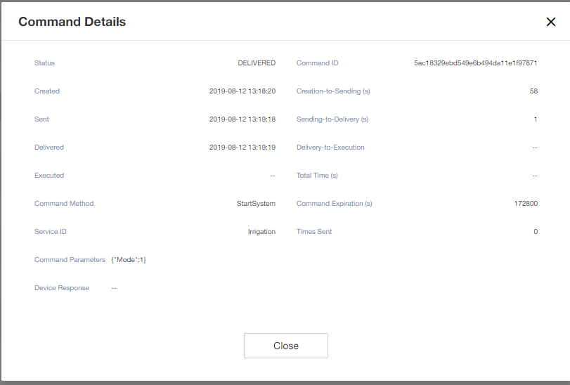

# Send command to the Device via IoT-Gateway

First and foremost check your respective device model or Product profile, whether it contains any commands or not. For this document we have used  `"Irrigation"` product profile. [You can find Irrigation product profile in `Product Profiles --> Irrigation_TMAIoT_DemoDevice` ]
 
## Step : 1  Go to the Device and to the Commands section
1. Click on Commands
2. Click on Send command
   
  

## Step 2 Send the Command 
1. Select the Command 
2. Select the Mode. (Mode is command for Irrigation, It is depending on your product model. If you use another product model, you might get another option.)
3. Click on Confirm.

  

## Step 3 Command Delivery
1. Putty command delivery snapshot.
 
      

2. Platform Command status snapshot.
 
     

3. Platform Command details snapshot.
 
      

