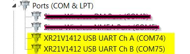
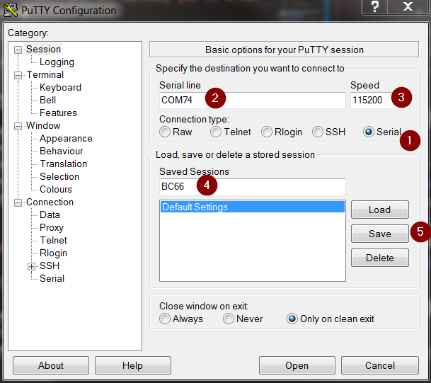
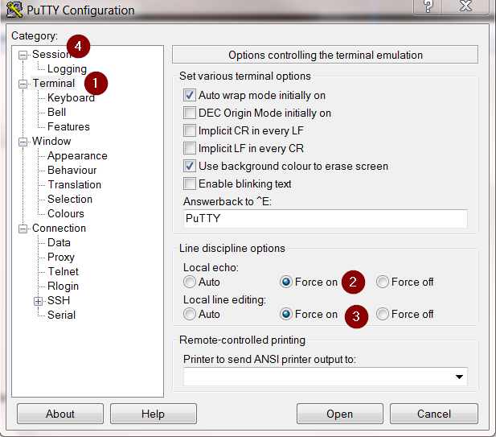
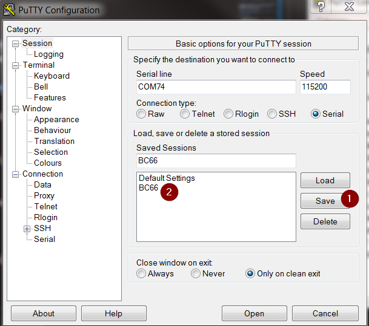
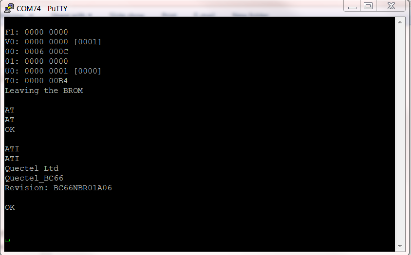
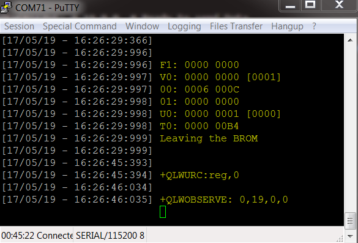

# Connect Quectel BC66 to IoT-Gateway

!> **Prerequisites**
 > * Install Putty   
 > https://www.chiark.greenend.org.uk/~sgtatham/putty/latest.html
 > * Download latest Drivers  
 > https://www.exar.com/product/interface/uarts/usb-uarts/xr21v1412

# Configure Device
1. Insert SIM Card
2. Mount antenna
3. Check if DIP-Switch (J302) is in position: MAIN UART TO USB
4. Connect it with USB to your PC
5. Install Drivers
6. Check in Device Manager the correct COM-Port (Ch A)  
   
7. Open Putty  


# Configure Putty     

       
   1. Enter correct COM-Port
   2. Set Baud rate (Speed) to 115200
   3. Connection Type: Serial
   4. Enter "BC66" as name  
   5. Press save

       
   1. Select "Terminal"
   2. Local echo: Force On
   3. Local line editing: Force On
   4. Select "Session"  

       
   1. Press Save
   2. Double-Click to "BC66" to connect Putty to your BC66 Module  


# Check Connection  
   
  Press `PWR_Key` on the module  
  Enter `AT` to check module  
  Enter `ATI` to check module

# Prepare BC66 / Connect to the NB-IoT Network  
```
    **"Press the PWR_Key on the Module"**
     F1: 0000 0000
     V0: 0000 0000 [0001]
     00: 0006 000C
     01: 0000 0000
     U0: 0000 0001 [0000]
     T0: 0000 00B4
     Leaving the BROM

    AT                                      #check the module
    --> OK                                  
    
    ATI                                     # check the revision of the module
    --> Quectel_Ltd
        Quectel_BC66
        Revision: BC66NBR01A06

        OK

    AT+QCGDEFCONT="IP","alliot.nbiot.at"    # Set APN
    --> OK 

    AT+QRST=1                               # Restart, will take 5 sec
    --> F1: 0000 0000
        V0: 0000 0000 [0001]
        00: 0006 000C
        01: 0000 0000
        U0: 0000 0001 [0000]
        T0: 0000 00B4
        Leaving the BROM    

    AT                                      # Auto baud synchronization
    --> OK

    AT+CFUN?                                # Radio Module Functionality 
    --> +CFUN : 1                           # 1 means fully functionality

    AT+QCGDEFCONT?                          # Check the APN
    --> +QCGDEFCONT: "IP","alliot.nbiot.at"

    AT+CEREG=1                              # Enable network registration unsolicited 
    --> OK

    AT+CPSMS=0                              # Disable Power Saving Mode
    --> OK

    AT+CSCON=1                              # Enable Signalling Connection Status
    --> OK  
    
    --> +CSCON: 1                           # Connected Mode

    --> +CEREG: 5                           # Attached to Network

    --> +IP: 1*.*.*.***                     # IP Address
                      
```
**NOTE: The fist time to connect can take up to 5-7 minutes. (until CEREG: 5)**

## Next Step: Send data from your Device to IoT-Gateway  / Link: [Send DATA](./Quectel_BC66/04_Send_Data_BC66.md) {docsify-ignore}

# Troubleshooting

##  Connect BC66 to IoT-Gateway Manually 

``` 
--After Connecting to the Network follow these AT commands--

AT+CGATT?                                   # Query the attach status
--> +CGATT: 1                               # Attached to the PS service

AT+CGPADDR=1                                # IP Address
--> +CGPADDR: 1,1**.**.**.***

AT+QLWCFG="auto_reg",1                      # Auto register to the IoT Platform
--> OK

// Configure the Ip and port of the IoT-Gateway
AT+QLWCONFIG=0,10.112.28.10,5683,86***********77,900,3
--> OK

AT+QLWCONFIG?                               # Query for the IP and port
--> +QLWCONFIG:0,10.112.28.10,5683,"86***********77",900,3

AT+ QLWREG                                  # Registration Request
--> OK

    +QLWURC: reg,0

    +QLWOBSERVE: 0,19,0,0

```

**If the modem responses this 2 lines you are successfully connected to IoT-Gateway and able to send and receive data**
```
+QLWURC: reg,0                     # Registration on IoT-Gateway successful  
+QLWOBSERVE: 0,19,0,0              # Observe an object 19  
```
**Once you receive the notification of successful registration and observe an object 19, after every reboot module will connect to the IoT-Gateway automatically.**



## Check Signal
```
AT+CESQ                             # Query the signal strength
--> +CESQ: 40,7,255,255,0,48

    OK

AT+QENG=0                           # Query the module status.
--> +QENG: 0,3547,2,127,"490A65",-91,-21,-70,1,8,"3AD6",0,230

    OK  
```  

## Check IP Address
``` 
AT+CGPADDR=1
-->  +CGPADDR:1,10.X.Y.Z

     OK
```

## Check IoT-Gateway  
* [Add your first device](./02_Add_first_Device.md)
* Check if your IMEI is correct.


