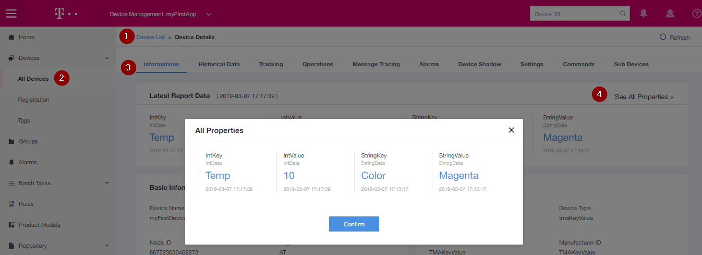
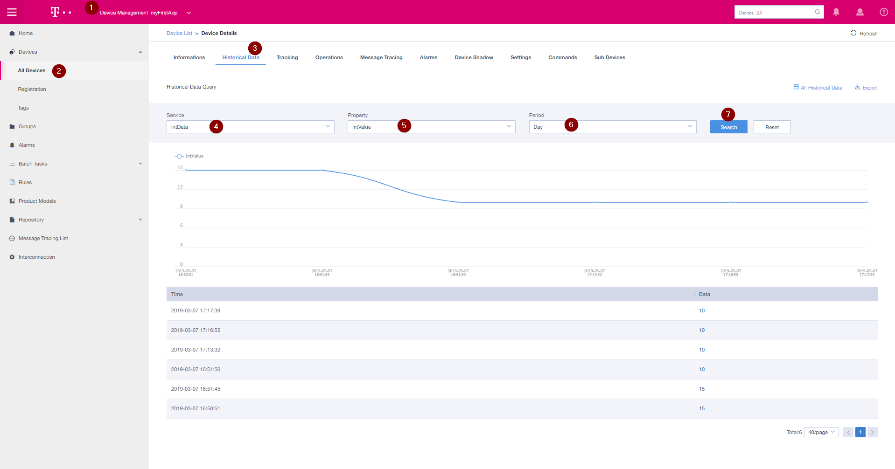
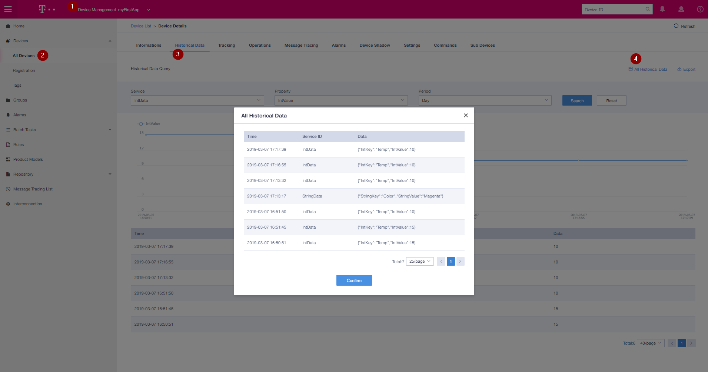

[Detailed Information about Upload Protocol](GenericKeyValue_LWM2M.md)

In this tutorial we are using the GenericKeyValue Product Model, here we always have to upload a Key and a Value (e.g Key="Temp", Value=23).

In Production you will have a specific Product Model for your Device, then you only will upload the Value. 

FYI: ASCII to Hex Converter: https://www.binaryhexconverter.com/ascii-text-to-hex-converter
 

## Send Integer Data

Command Syntax:
```
AT+QLWDATASEND = 19,0,0,8,060454656d70000F,0x0100 
// Syntax Parameters Details : 
// <obj_id> :         19       : Integer; Object ID 
// <ins_id> :          0       : Integer; Instance ID
// <res_id> :          0       : Integer; Resources ID.
// <length> :          8       : Integer; Length of hex string data sent
// <data>   : 060454656d70000F : Hex; {06:MsgId, 04:key_Len(hex), 54656d70:key(ascii_hex), 000F:value(hex)}
// <mode>   :       0x0100     : Send CON message
```
Info:  
MsgId 06 => IntData with no Response from IoT-Gateway  
MsgId 01 => Int Data with Response from IoT-Gateway / Response = (AA01)

"Temp" in ASCII (Hex) = 54656d70  (54 65 6d 70 => T e m p)    

1. Check if device registration is complete (Response after connect to network):  
   ```
     +QLWURC: reg,0                 // register successfully

     +QLWOBSERVE: 0,19,0,0          // IoT Gateway successfully observe object 19
   ```
2. Send Data **without** confirmation  
    `AT+QLWDATASEND = 19,0,0,8,060454656d70000F,0x0000`     // Data: Temp=15
3. Send Data **with** confirmation  
    `AT+QLWDATASEND = 19,0,0,8,060454656d70000F,0x0100`   //Data Temp=10  
    Response:  
    `OK`    
    `SEND OK`

    If there is any error, response:
    `SEND FAIL`


FYI: If you need a response from IoT-Gateway - just use MsgId 01 instead of 06

## Send String Data

Command Syntax:
```
AT+QLWDATASEND = 19,0,0,15,0005436f6c6f72074d6167656e7461,0x0100
// Syntax Parameters Details : 
// <obj_id> :         19       : Integer; Object ID 
// <ins_id> :          0       : Integer; Instance ID
// <res_id> :          0       : Integer; Resources ID
// <length> :          15      : Integer; Length of hex string data sent
// <data>   : 0005436f6c6f72074d6167656e7461 : Hex; {00:MsgId, 05:key_Len(hex), 436f6c6f72:key(ascii_hex), 07:value_len(hex), 4d6167656e7461:value(ascii_hex)}
// <mode>   :       0x0100     :  Send CON message
```
Info:  
MsgId 07 => String Data with no Response from IoT-Gateway  
MsgId 00 => String Data with Response from IoT-Gateway / Response = (AA00)

1. Send String Data with Response from IoT-Gateway  
   In this Example we will send Key=Color / Value=Magenta     
   Color in ASCII Hex = 436f6c6f72  / Len=5  
   Magenta in ASCII Hex = 4d6167656e7461 / Len=7  
   
   `AT+QLWDATASEND=19,0,0,15,0005436f6c6f72074d6167656e7461,0x0100`  
   Response:
   ```
   SEND OK                             // CON message confirmation

   +QLWDATARECV: AA00                  // receive server downlink data
   ```

2. Send JSON Data with Response from IoT-Gateway  
   Key = "DATA",  => 44415441 / len: 4  
   Value = {"Temp":22.3,"Hum":20,"Weight":23,"Color":"Magenta"} =>  
   7b2254656d70223a32322e332c2248756d223a32302c22576569676874223a32332c22436f6c6f72223a224d6167656e7461227d  / len: 52 = 0x34

   `AT+QLWDATASEND=19,0,0,59,000444415441347b2254656d70223a32322e332c2248756d223a32302c22576569676874223a32332c22436f6c6f72223a224d6167656e7461227d,0x0100`  

   Response:
      ```
   SEND OK                             // CON message confirmation

   +QLWDATARECV: AA00                  // receive server downlink data
   ```

FYI: If you don't need a response from IoT-Gateway to save traffic and power - just use MsgId 07 instead of 00

# Watch data on IoT-Gateway

## Last Data

1. Choose Application
2. Select your Device
3. Select Information Tab
4. Click "See All Properties"

## Historical Data

1. Choose Application
2. Select your Device
3. Select Historical Data Tab
4. Select the Service 
5. Select the property
6. Select the period (Hour,Day,Week,Year)
7. Click on "Search"

## ALL Historical Data

1. Choose Application
2. Select your Device
3. Select Historical Data Tab
4. Click on "All Historical Data"

## Next Step: [Start to get your data out of IoT-Gateway](./Application_Enablement/05_Install_and_setup_Postman.md) {docsify-ignore}

