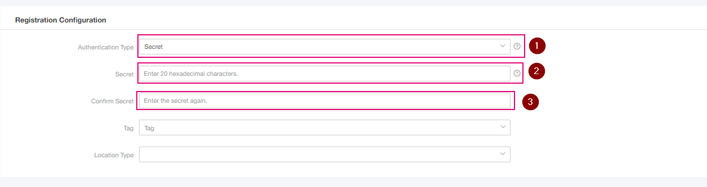
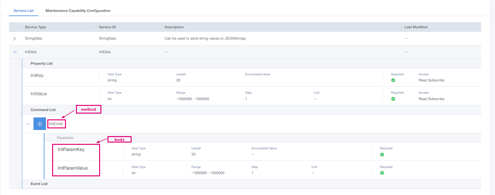
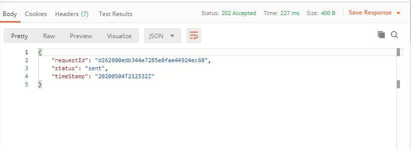
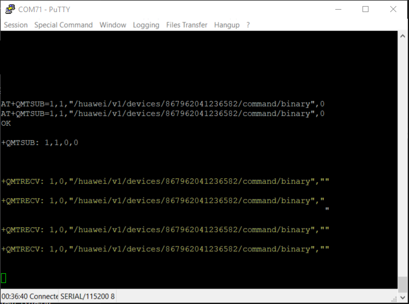
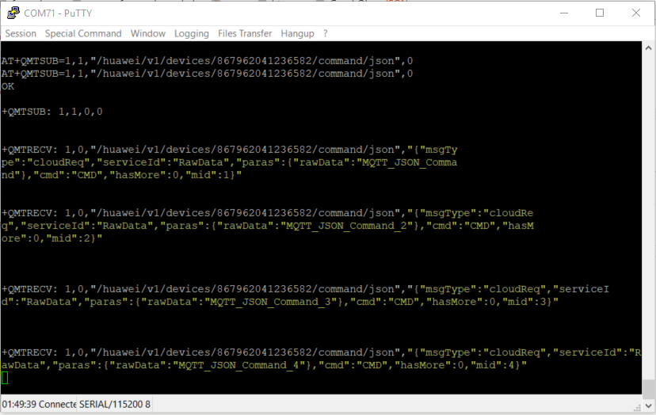

# Getting Started with EC21 and IoT-Gateway with MQTT

### Register Device in Magenta IoT-Gateway with IMEI as nodeID. 

### While registering device in IoT-Gateway, make sure authentication type selected as Secret and it's length should be 20 hexadecimal characters.



###  After registering the device, kindly note the device ID and device secret.

## 1. MQTT Configuration

### In case of **Public APN** :  Server: 160.44.204.79 // Port: 8883  
### In case of **Private APN** : Server: 10.112.28.20 // Port: 8883

MQTT_Client_ID: `{IMEI}_2_0_{KEY}`  

For `{KEY}`, write any 10 digit number.

## 2. Password and Username configuration

Username: `{IMEI}`

Password:    <https://codebeautify.org/hmac-generator>  
             Algorithm: HmacSHA256  
             Key: `{KEY}` -- same as in the MQTT_Client_ID  
             Plain or Cipher Text: `device secret` [ `Secret` should be same which is used while device registration in the IoT-Gateway.]  
             Result Hash-Value is the **Password!**


## 3. AT Commands for MQTT connection and send the data
```javascript
AT+QMTCFG="SSL",1,1,2       // SSL connection configuration
---> OK

AT+QMTOPEN=1,"160.44.204.79",8883   //IoT-Gateway Server IP and port, IP and port can be changed in case of public or private APN
---> OK
---> +QMTOPEN: 1,0

AT+QMTCONN=1,"{MQTT_Client_ID}","{IMEI}","{Password}"
---> OK
---> +QMTCONN: 1,0,0
```
```javascript
AT+QMTPUB=1,0,0,0,"/huawei/v1/devices/{IMEI}/data/json"

 {
  "identifier": "123",
  "msgType": "deviceReq",
  "hasMore": 0,
  "data": [
    {
      "serviceId": "{serviceId}",
      "serviceData": {
        "{parameter_1_Name}": {parameter_1_Value},
        "{parameter_2_Name}": {parameter_2_Value}
        ...
        ...
        "{parameter_N_Name}": {parameter_N_Value}
      }
    }
   ]
  }
CTRL+Z

---> +QMTPUB: 1,0,0
```

## 4. Send commands to Device via Postman

### Before configure in Postman or or any other NA, Device must have subscribed the topic either "`/huawei/v1/devices/{IMEI}/data/binary`" or "`/huawei/v1/devices/{IMEI}/data/json`" depending on your requirement. 

**IMPORTANT NOTE for subscribe MQTT topic :**

**Binary command mode :** "`/huawei/v1/devices/{IMEI}/data/binary`": If you want to send binary command to the device. binary is only supported in case of Device profile along with CIG plugin in IoT-Gateway.

**Json command mode :** "`/huawei/v1/devices/{IMEI}/data/json`": If you want to send Json command to the device. Json is only supported in case of Device profile without CIG plugin in IoT-Gateway. Such as raw data product model.

**Only one mode is supported at a time, never both. (as it is depends on device product model)**
****


```javascript
//Command as binary 
AT+QMTSUB=1,1,"/huawei/v1/devices//huawei/v1/devices/{IMEI}/data/binary",0
---> OK
---> +QMTSUB: 1,1,0,0

//Command as Json
AT+QMTSUB=1,1,"/huawei/v1/devices//huawei/v1/devices/{IMEI}/data/json",0
---> OK
---> +QMTSUB: 1,1,0,0
```

## 5. Postman setup 

### If you are using same previous Postman environment, kindly change the respective appID, deviceID and secret.

**Method** : `POST`

**URL** : `https://server:port/iocm/app/signaltrans/v1.1.0/devices/{deviceId}/services/{serviceId}/sendCommand?appId={appId}`  

**Authorization** : Bearer token type, Token : `accessToken` from the login. (If you are using postman collection, select inherit auth from parent as type and click on collection name paste accessToken. Postman will keep this tocken for next requests.)

**Headers** : 
1. KEY : app_key  , VALUE : {appID}
2. KEY : Content-Type ,  VALUE : application/json

**Body** :
```javascript
{
	"header":
	{
		"mode": "ACK" ,
		"method": "xxxx"
	},
	"body":
	{
		"Parameter1": "value",
        "Parameter2": "value",
        .
        .
        "ParameterN": "value"
	}
}
```

**Request** **body** **example** **in** **case** **of** **Product** **model** **:** **TMA_KeyValue**
```javascript
{
	"header":
	{
		"mode": "ACK" ,
		"method": "IntCmd"
	},
	"body":
	{
		"IntParamKey": "Magenta_LED",
        "IntParamValue": 5     
	}
}
```
**Product model in IoT-Gateway, for ease to understand body.**



After completing body part, click on send ! 

**Response in Postman :**



**Commands in Putty in Binary command mode: (in this case my device registered with device profile + CIG plugin in IoT-Gateway**




**Commands in Putty in Json command mode: (in this case my device registered with only device profile.**


 


