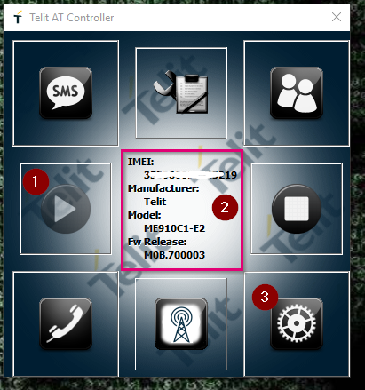

!> Prerequisites
 > If you using ME910C1-E2 EVK (Evaluation kit), download EVK/EVB drivers and AT controller software from [Telit website download section.](https://www.telit.com/evkevb-drivers/)  
 >Insert the Simcard in proper simcard slot and connect the antennas.  
 >If you using module, open the respective port for the AT commands.  
 >IF you using EVK, open AT-Controller software.

# AT commands and response from Module
* Open AT Controller and follow these steps 

      

    1. Click on second left button which look like play button.
    2. After clicking on button, wait for 2 or 3 seconds you will see the information about the module as shown in box.
    3. Click on last button, which opens a AT-Command prompt. Once its open follow AT commands given below.


# AT commands to connect with NBIoT network and response from Module

```

AT                   // Check the module functionality 
--> OK

AT+CMEE=2           //Report mobile termination error, 2 means error code enabled and verbose value used
--> OK

AT#BND=5,0,524420   //Band selection
--> OK

AT+CFUN=1           // enable full module functionality 
--> OK

AT+CGDCONT=1,"IP","catm"  // Set the APN as a "catm" for the Magenta LTE-M sim cards
--> OK
           
AT#REBOOT           // Reboot the module
--> OK

AT+CGDCONT?         // Check the APN
--> +CGDCONT: 1,"IP","catm","",0,0,0,0
--> +CGDCONT: 2,"IPV4V6","","0.0.0.0.0.0.0.0.0.0.0.0.0.0.0.0",0,0,0,0
--> +CGDCONT: 3,"IPV4V6","","0.0.0.0.0.0.0.0.0.0.0.0.0.0.0.0",0,0,0,0
--> +CGDCONT: 4,"IPV4V6","","0.0.0.0.0.0.0.0.0.0.0.0.0.0.0.0",0,0,0,0
--> +CGDCONT: 5,"IPV4V6","","0.0.0.0.0.0.0.0.0.0.0.0.0.0.0.0",0,0,0,0
--> +CGDCONT: 6,"IPV4V6","","0.0.0.0.0.0.0.0.0.0.0.0.0.0.0.0",0,0,0,0

--> OK

AT#WS46=0       // Set the IoT Technology, 0 means CAT-M
--> OK

AT+WS46=30      // Set command to select the celluler network, 30 means GERAN and E-UTRAN
--> OK

AT+CEREG=1      // enable the network registration unsolicited result code & select the short format
--> OK

AT+CREG=1       //Network registration status, 1 means network registration URC +CREG: <stat> enabled
--> OK

AT+COPS=?         // Check the available networks
+COPS: (1,"T-Mobile A","T-Mobile A","23203",0),....,(2,"T-Mobile A","T-Mobile A","23203",8),....,,(0-4),(0-2)
--> OK


AT+COPS=1,2,"23203",8   //Manually network selection, 23203 is PLMN code for Magenta Telekom
--> OK

AT+CEREG?       // Check the network status, 1 menas enable the network unsolicited result enabled and 1 means home netowrk registered  
--> +CEREG=1,1
--> OK

AT+CGCONTRDP    // Network behaviour, +CGCONTRDP: <cid>,<pcid>,<bearer_id>,[..]
--> +CGCONTRDP: 1,5,"catm","10.***.***.***",,"*.*.*.*","*.*.*.**"
--> OK
````

## Check Signal strength 

``` 
AT+CSQ           // Signal quality +CSQ: <rssi>,<ber>
    --> +CSQ: 31,2
     --> OK        

    <rssi> : Received Signal Strength Indication measure
    Values:
    0      : -113 dBm or less
    1      : -111 dBm
    2÷30   : -109 dBm ... -53 dBm; 2 dBm per step
    31     : -51 dBm or greater
    99     : not known or not detectable
        
    <ber>   : ber parameter is mapped to channel Bit Error Rate measure
    Values:
    0      : less than 0.2%
    1      : 0.2% to 0.4%
    2      : 0.4% to 0.8%
    3      : 0.8% to 1.6%
    4      : 1.6% to 3.2%
    5      : 3.2% to 6.4%
    6      : 6.4% to 12.8%
    7      : more than 12.8%
    99     : not known or not detectable
               

 AT#SERVINFO      // Serving cell information
     --> #SERVINFO: 6400,-43,"T-Mobile A","23203",00000AF,36EE,32,3,-60         
     --> OK  

     #SERVINFO:<EARFCN>,<dBM>,[<NetNameAsc>],<NetCode>,<PhysicalCellId>,<TAC>,<DRX>,<SD>,<RSRP>

 AT+CESQ         // Extended Signal quality 
     --> +CESQ: 99,99,255,255,34,81
     --> OK

```

## Check IP Address

``` 
        AT+CGPADDR=         //Show address of the PDP context 1
        Response:
        +CGPADDR: 1,"10.***.***.***"
        +CGPADDR: 2,""
        +CGPADDR: 3,""
        +CGPADDR: 4,""
        +CGPADDR: 5,""
        +CGPADDR: 6,""

        OK
```