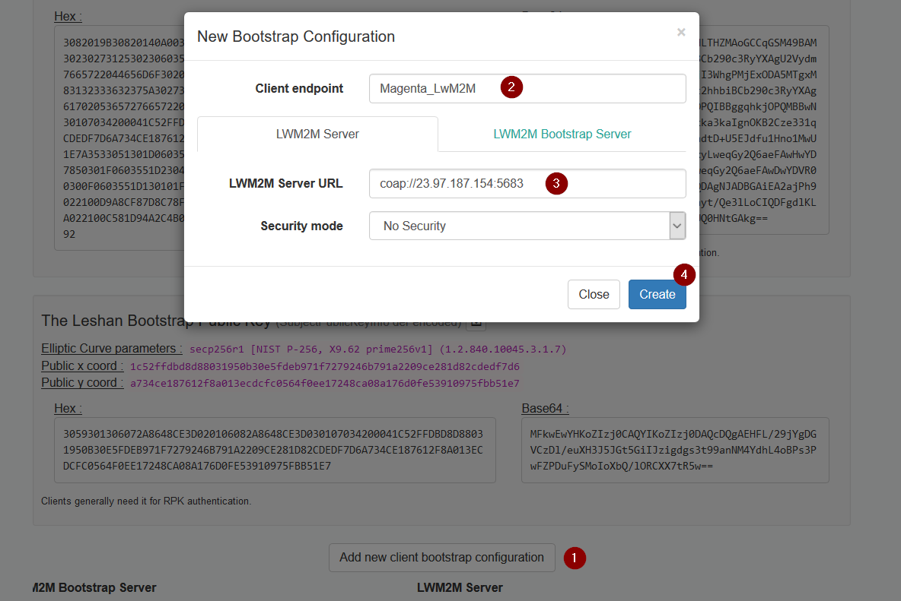
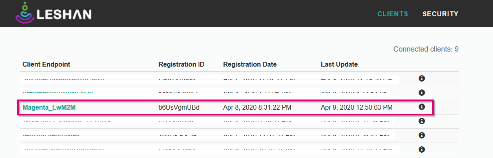
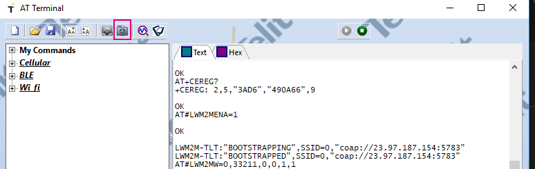
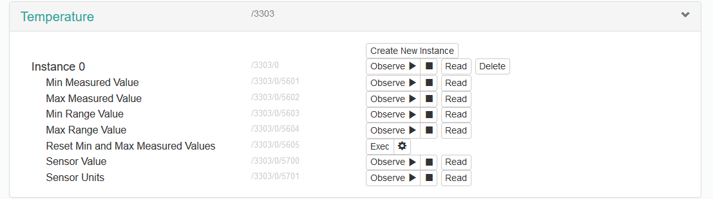
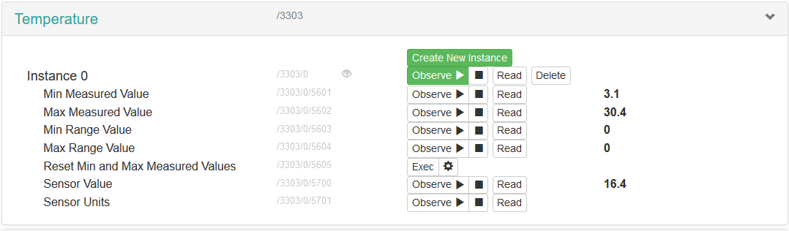

# Connection and Communication with Leshan LwM2M Server 

### To connect with leshan server, UE must have connected with network and established PDP connection.

## Configuration Bootstrap parameters.
To configure the Bootstrape parameters, go to http://leshan.eclipse.org/bs/ and follow the steps written below.



1. Click on Add new client bootstrap configuration.
2. write the Client endpoint name.
3. write the LwM2M Serer URL (Typically leshan DM server URL IP and port)
4. click on create.

## Connection AT Commands 
```javascript

// Setup the bootstrap server
// AT#LWM2MSTS=<agentInstance>[,<serverURI>[,<URI>[,<isBootstrapServer>]]]
AT#LWM2MSTS=0,999,"coap://23.97.187.154:5783",1
---> OK

// Setup the end point
// AT#LWM2MINJKEYS=0,1,"endpoint name","psk id","psk key in hex "
AT#LWM2MINJKEYS=0,1,"Magenta_LwM2M"
---> OK

AT#REBOOT
---> OK

AT+CEREG=2
---> OK

AT+CEREG?
---> +CEREG: 2,5,"3AD6","490A66",9

// Enable the Telit LwM2M Agent
AT#LWM2MENA=1
---> OK

// Automatic response 
LWM2M-TLT:"BOOTSTRAPPING",SSID=0,"coap://23.97.187.154:5783"
LWM2M-TLT:"BOOTSTRAPPED",SSID=0,"coap://23.97.187.154:5783"

// LwM2M Client Resource writing
AT#LWM2MW=0,33211,0,0,1,1
---> OK

AT#REBOOT
---> OK

AT+CEREG=2
---> OK

AT+CEREG?
---> +CEREG: 2,5,"3AD6","490A66",9

AT#LWM2MENA=1
---> OK

// Automatic response 
LWM2M-TLT:"REGISTERING",SSID=123,"coap://23.97.187.154:5683"
LWM2M-TLT:"REGISTERED",SSID=123,"coap://23.97.187.154:5683"

```
After these AT commands, you will able to see your device in list of devices in Leshan DM server (http://leshan.eclipse.org/#/clients). 




## Add custom LwM2M Object 

Here, we shown AT commands to add the Object 3303 (Temperature Object) via Telit AT command terminal. 

1. Download the Object 3303 xml file from OMA object registry.

2. ```javascript

    // Write a file
    // AT#M2MWRITE=<full_path_file_name>,<size>
    AT#M2MWRITE="/XML/object_3303.xml",5522

    >>>  //upload the file from Telit AT controller as shown in the figure below.

    ---> OK
   ```

   

3. To initialise the added custom object and add the instance for that object follow the AT commands below.

    ```javascript
    AT#REBOOT
    ---> OK

    AT+CEREG=2
    ---> OK

    AT+CEREG?
    ---> +CEREG: 2,5,"3AD6","490A66",9

    AT#LWM2MENA=1
    ---> OK

    // Automatic response 
    LWM2M-TLT:"REGISTERING",SSID=123,"coap://23.97.187.154:5683"
    LWM2M-TLT:"REGISTERED",SSID=123,"coap://23.97.187.154:5683"

    // Create a New Object Instance
    // AT#LWM2MNEWINST=<agentInstance>,<objectID>,<objectInstanceID>
    AT#LWM2MNEWINST=0,3303,0
    ---> OK
    ```
    
    

4. Send the data to leshan server
    ```javascript
    // Set LwM2M Temperature Resource
    // AT#LWM2MSET=<type>,<objectID>,<objectInstanceID>,<resourceID>,<resourceInstanceID>, <value>

    AT#LWM2MSET=1,3303,0,5601,0,23.4
    ---> OK
    
    AT#LWM2MSET=1,3303,0,5601,0,3.10
    ---> OK

    AT#LWM2MSET=1,3303,0,5602,0,30.4
    ---> OK

    ```
    
